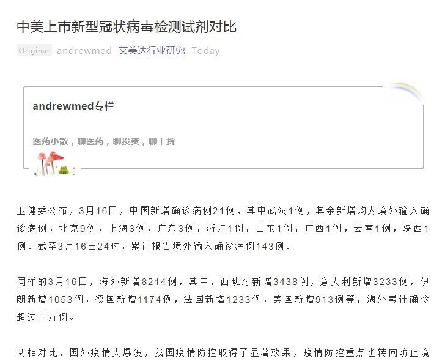
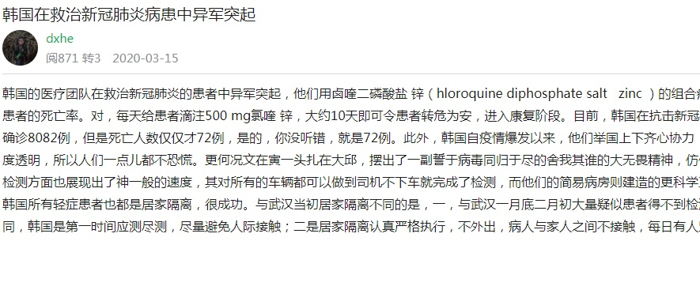
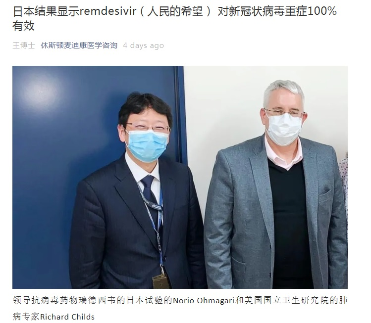
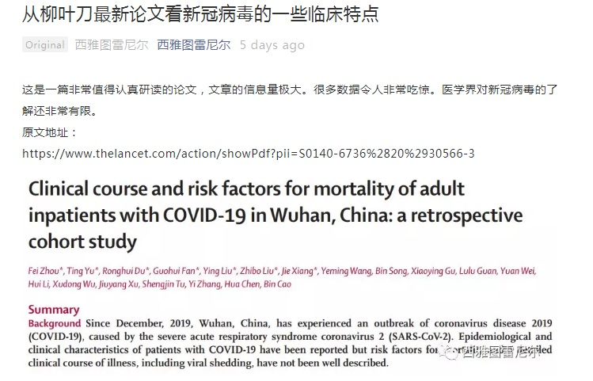
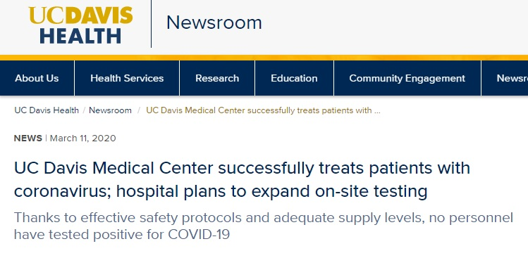
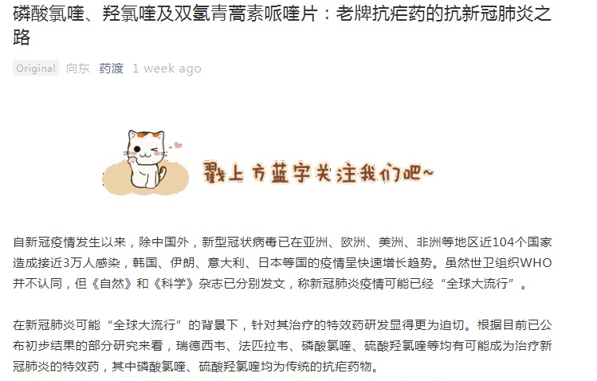
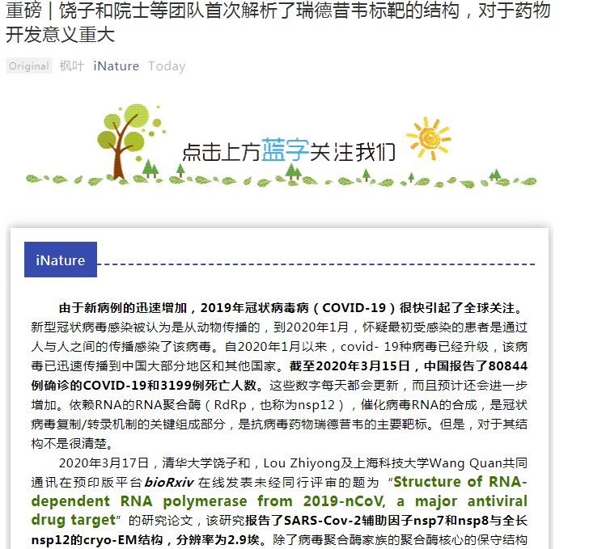
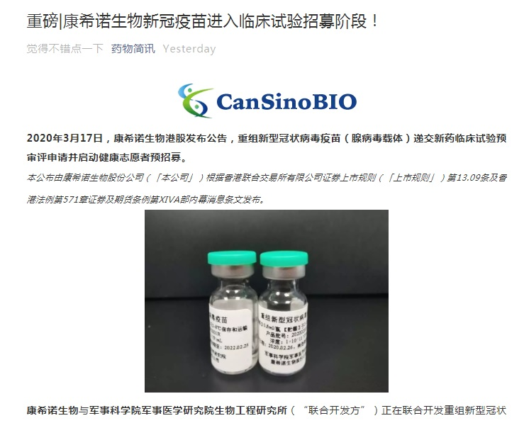
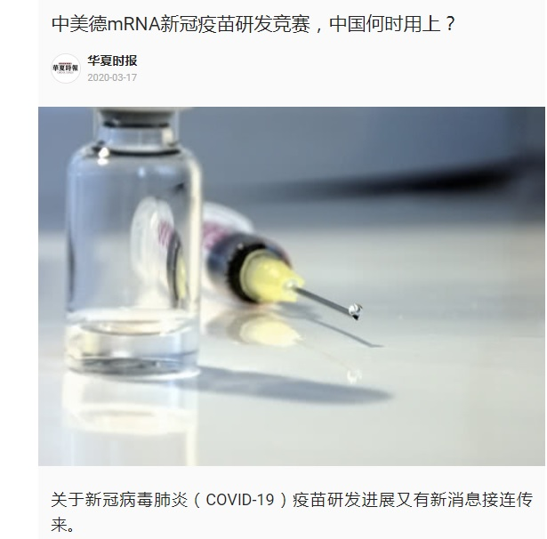

# 全球肺炎实战共享平台

马云公益基金会、阿里巴巴公益基金会、浙江大学附属第一医院联合发起建立的这个全球新冠肺炎实战共享平台，将专注为世界各地的一线医生和护士提供抗疫实战经验分享，方便他们在线交流协作，为相关科研提供AI大数据和计算能力支撑。

**[肺炎实战共享平台](https://covid-19.alibabacloud.com/zh?from=timeline&isappinstalled=0)**

***

***
  
  
- [COVID-19 治疗相关报道](#covid-19-------)
    + [疫情地图](#疫情地图)
  * [检测试剂](#检测试剂)
  * [治疗方案](#治疗方案)
  * [疫苗相关／新药开发](#疫苗相关／新药开发)
  * [研究进展](#研究进展)
  * [典型病历史报道](#典型病历史报道)
  * [其他](#其他)
  * [妖孽存照 ](#妖孽存照)
  * [COVID-19-Github](#COVID-19-Github)
  * [相关股票](#相关股票)

# COVID-19 治疗相关报道

 ***

### 疫情地图

-[Coronavirus COVID-19 Global Cases by the Center for Systems Science and Engineering](https://coronavirus.jhu.edu/map.html)

-[Novel coronavirus (COVID-19) outbreak timeline map](https://www.healthmap.org/covid-19/)

-[Novel coronavirus infection map](https://hgis.uw.edu/virus/)

-[Novel coronavirus (COVID-19) situation dashboard (WHO)](https://who.maps.arcgis.com/apps/opsdashboard/index.html#/c88e37cfc43b4ed3baf977d77e4a0667)

-[Coronavirus: the new disease Covid-19 explained](https://multimedia.scmp.com/infographics/news/china/article/3047038/wuhan-virus/index.html?src=article-launcher)

-[全球新冠病毒最新实时疫情地图_丁香园](https://ncov.dxy.cn/ncovh5/view/pneumonia)

-[北美版丁香园 美国和加拿大 疫情地图实时动态追踪](https://coronavirus.1point3acres.com/)

 ***
 
## 检测试剂

- [**2020-03-17 中美上市新型冠状病毒检测试剂对比**](https://mp.weixin.qq.com/s?__biz=MzA3ODgzODc5NA==&mid=2651778806&idx=1&sn=241867507717156503d81c7694487f57&chksm=8446e393b3316a856f0b8e5381f13d5b7a401e776b92af57c075d2d71c807d7be6a3721c5280&mpshare=1&scene=1&srcid=0318xetmhIcbKxoRNtN4AmfM&sharer_sharetime=1584492582044&sharer_shareid=a95d81bba82caa939c92c4c89cf532d1&exportkey=Anhhsami5IaqdwlUjPVAtbE%3D&pass_ticket=Ym0fpwqfCHTJOr2fhlHchYZ8NaqDH4zPzxIH4YkaW0zpdzFeWiSxEe6AgNZ1RNSD#rd)

- [**2020-03-14 罗氏 cobas SARS-CoV-2 检测获得FDA紧急使用授权，显著提高新型冠状病毒检测能力**](https://mp.weixin.qq.com/s?__biz=MzAxMjA5ODExMg==&mid=2649767588&idx=1&sn=4258907ea9e07394bec8215b7a35a811&chksm=83b3918bb4c4189d0d4ed717b7600ac9dba3764055c108657cebbe843ede24efb9edeaa74c32&mpshare=1&scene=1&srcid=03181WPcXsMbuTty8hDY8SuP&sharer_sharetime=1584499170738&sharer_shareid=a95d81bba82caa939c92c4c89cf532d1&exportkey=AuBZoeH9Lf35GRebQY31wQQ%3D&pass_ticket=Ym0fpwqfCHTJOr2fhlHchYZ8NaqDH4zPzxIH4YkaW0zpdzFeWiSxEe6AgNZ1RNSD#rd)

 ***
 
## 治疗方案

- [**2020-03-19 FDA Announces Two Drugs Approved for ‘Compassionate Use’ in Treating COVID-19**](https://www.pharmacytimes.com/news/fda-announces-two-drugs-approved-for-compassionate-use-in-treating-covid-19?from=timeline&isappinstalled=0)

- [**2020-03-19 《柳叶刀》：抗击疟疾耐药！青蒿素三联疗法安全有效，八国试验支持“现成新选择”**](https://mp.weixin.qq.com/s?__biz=MzAxOTU2OTU4MQ==&mid=2649914444&idx=1&sn=81e64fd62e00ca24685a4a46b28b88a9&chksm=83c3d28eb4b45b982607257e82467414422413209005a038d45f3361b24a65b6cae89a469626&mpshare=1&scene=1&srcid=&sharer_sharetime=1584631681034&sharer_shareid=a9c952ab6f63a17519bb96b39232e47e&exportkey=Ashr9%2FZrKtywenwn00lVf1k%3D&pass_ticket=QVc%2BaIiodq8ErwN1pzyLkkQt3E8FKT9U6n%2BhlSiB9UjrSqz9%2FdqAOv4oPluzeLwh#rd)

- [**2020-03-19 NEJM重磅 | 随机对照研究，王辰院士等揭示洛匹那韦–利托那韦治疗重症新冠肺炎无效**](https://mp.weixin.qq.com/s?__biz=MzU3MTE3MjUyOA==&mid=2247507768&idx=3&sn=84c66d44de6c56cb16c7f3ced95e6502&chksm=fce6ace7cb9125f15cc0bcda0551eac8683914b548e325b5a0fef3a3cc08fd3504628c23ed77&mpshare=1&scene=1&srcid=&sharer_sharetime=1584582466849&sharer_shareid=a95d81bba82caa939c92c4c89cf532d1&exportkey=Ah76d9fDSGUDGIYnc1z%2BIH0%3D&pass_ticket=zWVYVxV8%2FgP9pcTskTZ3kJK2M8M7CIt2zKwqd%2FuyaF7zWd5K0R%2BUKfTp4dSrfWX8#rd)

- [**2020-03-18 After 6 days 100% of patients treated with HCQ + Azithromycin  were virologically cured**](https://twitter.com/RiganoESQ/status/1240273631604809728) 

- [**An Open Data Clinical Trial for COVID-19 Prevention**](https://www.covidtrial.io/)

- [**2020-03-18 Japanese flu drug 'clearly effective' in treating coronavirus, says China**](https://www.theguardian.com/world/2020/mar/18/japanese-flu-drug-clearly-effective-in-treating-coronavirus-says-china)

- [**2020-03-18 直接比较候选疗法疗效，世卫组织启动大型全球性COVID-19临床试验**](https://mp.weixin.qq.com/s?__biz=MzAwMDA5NTIxNQ==&mid=2649992335&idx=1&sn=297d49e5094715a0c0c106adc8310bfc&chksm=82e92a0fb59ea31918a7ffcbd96b9b9cf7c7a0612b48ac23032132741bcd489f8cf71339d865&mpshare=1&scene=1&srcid=&sharer_sharetime=1584574344481&sharer_shareid=7aebabece500f47b2bda8614435da29f&exportkey=AiLoVnqqZ7L7DAn%2Bkk7d6Xo%3D&pass_ticket=zWVYVxV8%2FgP9pcTskTZ3kJK2M8M7CIt2zKwqd%2FuyaF7zWd5K0R%2BUKfTp4dSrfWX8#rd)

- [**2020-03-15 韩国在救治新冠肺炎病患中异军突起**](http://www.360doc.cn/article/1120683_899395057.html)

- [**2020-03-13 日本结果显示remdesivir ( 人民的希望） 对新冠状病毒重症100%有效**](https://mp.weixin.qq.com/s?__biz=MzA5MTI5MDY5Mg==&mid=2649570394&idx=1&sn=14a024fcc63b0b59b800dbee7279be32&chksm=88673171bf10b867c58efb5c0e0cc2bcdf6deb83e88c125e22bc74e4a236690e8ecf8d23ad87&mpshare=1&scene=1&srcid=0314bluSprgg77Lzm7QoPiLT&sharer_sharetime=1584499454786&sharer_shareid=a95d81bba82caa939c92c4c89cf532d1&exportkey=Ao9MAMZPymM%2B%2F4dQHj1eCgI%3D&pass_ticket=Ym0fpwqfCHTJOr2fhlHchYZ8NaqDH4zPzxIH4YkaW0zpdzFeWiSxEe6AgNZ1RNSD#rd)

- [**2020-03-12 从柳叶刀最新论文看新冠病毒的一些临床特点**](https://mp.weixin.qq.com/s?__biz=MzA3MjA5ODY1Mg==&mid=2658067545&idx=1&sn=5094fa06b961e28c6291afcdbb1b27b1&chksm=84b9326ab3cebb7c45ec8532fa3b889062c81f587828cddfc3bebca3911fb53bc1e50eb901c3&mpshare=1&scene=1&srcid=0318uPeqTqQ8WGx2kZo2O5PJ&sharer_sharetime=1584499340077&sharer_shareid=a95d81bba82caa939c92c4c89cf532d1&exportkey=AuN2XTaZCeQyD8fFZIHc0hY%3D&pass_ticket=Ym0fpwqfCHTJOr2fhlHchYZ8NaqDH4zPzxIH4YkaW0zpdzFeWiSxEe6AgNZ1RNSD#rd)

- [**2020-03-11 UC Davis Medical Center successfully treats patients with coronavirus; hospital plans to expand on-site testing**](https://health.ucdavis.edu/health-news/newsroom/UC-Davis-Medical-Center-successfully-treats-coronavirus-patients-hospital-plans-on-site-testing/2020/03?fbclid=IwAR0nx4lOlO8IPFrndv2pGMo5djlLke9KqE5HpRhVHVQNKSss0yUKslC0Diw&from=groupmessage&isappinstalled=0#.Xmzs6qkpkOG.facebook)

- [**20202-03-10 磷酸氯喹、羟氯喹及双氢青蒿素哌喹片：老牌抗疟药的抗新冠肺炎之路**](https://mp.weixin.qq.com/s?__biz=MzA5MjEzODQ3NA==&mid=2655775100&idx=1&sn=65ca8f9e49d6ae1ec832298a0700d335&chksm=8bcef7f9bcb97eeffb7c13146eae4b03ef8d261fb650f1f2bf22962285562d6446657d2e99b2&mpshare=1&scene=1&srcid=0318r5iFNTA29QGzMb48IWjv&sharer_sharetime=1584499661380&sharer_shareid=a95d81bba82caa939c92c4c89cf532d1&exportkey=AtivEd5X6cbq%2FNo5J1mqI1E%3D&pass_ticket=Ym0fpwqfCHTJOr2fhlHchYZ8NaqDH4zPzxIH4YkaW0zpdzFeWiSxEe6AgNZ1RNSD#rd)

 ***
 
## 疫苗相关／新药开发

- [2020-03-20 Nature提出5个新冠疫苗开发的关键问题](https://mp.weixin.qq.com/s?__biz=MzIzMTY2MTAzMA==&mid=2247487587&idx=1&sn=ec0a50fb41730cbe7bd32b133885c180&chksm=e8a19ceadfd615fcbf44b9f16f0c85b9888ee0ca84fb0e4f107d38849c03a4e61f2b3fe6620f&mpshare=1&scene=1&srcid=&sharer_sharetime=1584694780213&sharer_shareid=a7e32da51bd8652bf82fc868cc3dfc99&exportkey=ArM5YlG4bnru2jGA0z8WSDs%3D&pass_ticket=SwNVSziXYg%2B39Yug6qtVhPmKUap2vRoCaNfWY0Hz0mZcQW0ICYv1W18i7wQNgYf6#rd)

- [**2020-03-19 An Effective Treatment for Coronavirus (COVID-19)](https://docs.google.com/document/d/e/2PACX-1vTi-g18ftNZUMRAj2SwRPodtscFio7bJ7GdNgbJAGbdfF67WuRJB3ZsidgpidB2eocFHAVjIL-7deJ7/pub)

- [**2020-03-19 罗氏启动托珠单抗治疗重症COVID-19肺炎患者III期研究：招募330例患者**](https://mp.weixin.qq.com/s?__biz=MzA4MDA4MTIzMg==&mid=2653069451&idx=2&sn=16675ccd88483a21351f9c4e04125145&chksm=847fb8b4b30831a2f3434784e906afa6e496dc40f2fbe85050a07022fc8f142735d9526eee1e&mpshare=1&scene=1&srcid=&sharer_sharetime=1584659771876&sharer_shareid=a95d81bba82caa939c92c4c89cf532d1&exportkey=Atz40SPnsJzKmmqDoh1wXE0%3D&pass_ticket=8w0c%2FEMdX6%2Fj%2B6LnpiniQRWg1OgK%2BgY7vurlya0icShWG%2FfD9eCO0a39Eh2KzF5x#rd)

- [**2020-03-19 新冠疫苗，横空出世了吗？**](https://mp.weixin.qq.com/s?__biz=MzI5NTc5MTI3Nw==&mid=2247483909&idx=1&sn=06adf58ff3fc759bf3a8bc55ff77aeae&chksm=ec4f7dc7db38f4d1ee7c8bd25095abc0c59e7e6cde0c2011b625bf05ee21a8e1feb6295975c0&mpshare=1&scene=1&srcid=&sharer_sharetime=1584633862070&sharer_shareid=470b615c30870b5523881592816e9b3e&exportkey=ArEs7EJ6KBoly923Q1qLmCM%3D&pass_ticket=QVc%2BaIiodq8ErwN1pzyLkkQt3E8FKT9U6n%2BhlSiB9UjrSqz9%2FdqAOv4oPluzeLwh#rd)

- [**2020-03-19 医药创新界联署：解决新冠病毒等疫苗、药物研发停滞问题**](https://mp.weixin.qq.com/s?__biz=MzA5MTA2MDIxOQ==&mid=2247484099&idx=1&sn=41f1d63734d8a2e1391dfb1fca7fa89c&chksm=90036057a774e941b9e1656fa444976cef0f3b8873f6fac1f22d705934f36a94df628c6ee0d1&mpshare=1&scene=1&srcid=&sharer_sharetime=1584611272328&sharer_shareid=ccc7e15e8277d725ef3ca0c0363c259b&exportkey=AnidKXFyTvwzUGtVC7GwiyM%3D&pass_ticket=SmpVjidc%2Bpb9lRtyO5kZVjon%2Bxx1yNJOKkKHz58ZrkdkebmsPahazPlCwcHVdiXM#rd)

- [**2020-03-19 快讯！罗氏启动首个托珠单抗治疗新冠肺炎全球3期临床试验**](https://www.wuximediatech.com/content/post/detail.html?sn=8e7e6b5d1**48d435fa3285776f04fad9d&from=wechat)

- [**2020-03-18 Coronavirus vaccines: five key questions as trials begin**](https://www.nature.com/articles/d41586-020-00798-8)

- [**2020-03-18 英国启动万人试验：COPCOV (警察抓新冠) - 氯喹预防新冠肺炎的研究**](https://mp.weixin.qq.com/s?__biz=MzUxODkzOD**QxMA==&mid=2247488248&idx=2&sn=dff4d5861d3381a0741c9200b62a32fc&chksm=f98018bdcef791ab49e3b2e111896d06c80c5c7b4160f91b3bb7133dc0d13f9a74d2feb75fec&mpshare=1&scene=1&srcid=0319GJUYbt7n85e3cYSvD2Dn&sharer_sharetime=1584580213616&sharer_shareid=b68d8317789f29dcf2f5879eed2cdff5&exportkey=AnmXigczTeo%2Fbe1X8LdH2jQ%3D&pass_ticket=zWVYVxV8%2FgP9pcTskTZ3kJK2M8M7CIt2zKwqd%2FuyaF7zWd5K0R%2BUKfTp4dSrfWX8#rd)

- [**2020-03-18 新冠病毒重要药物靶点-RNA依赖的RNA聚合酶三维精细结构获得解析**](https://mp.weixin.qq.com/s?__biz=MjM5NTY5OTMxMA==&mid=2651311956&idx=1&sn=fe7b925bed54be440e8fab3fe0abee51&chksm=bd07e0558a706943da71ebf4b630ad0a4e4ae6c89440fc87478e659ad68dbb7d8b1c1e7ed7e1&mpshare=1&scene=1&srcid=&sharer_sharetime=1584563423612&sharer_shareid=a95d81bba82caa939c92c4c89cf532d1&exportkey=Au0JvES7EgSjwM%2BgI%2F8aJ2Y%3D&pass_ticket=I28Db8P7PMyKR5Lzw0ixxIajuVaMzahzUszVfVQGxr97QzRBKo%2By7BliS5XCSlsk#rd)

- [**2020-03-18 科技部：法匹拉韦完成临床研究，显示出很好的临床疗效，药品已实现量产**](https://mp.weixin.qq.com/s?__biz=MzAwODA5MjQ3Ng==&mid=2653089989&idx=1&sn=33b7bc6f866fb4ab04f32cb083c33f7a&chksm=80a27e96b7d5f780bb028c36fb08432811509324cf4e5698f2678ab15eb8a9c7febf92aab42d&mpshare=1&scene=1&srcid=0317Wh0ClXED19ytl3WO6Liq&sharer_sharetime=1584501785128&sharer_shareid=a95d81bba82caa939c92c4c89cf532d1&exportkey=AlDnjBcl3%2BmL%2F%2BhvY2gJg%2FM%3D&pass_ticket=Ym0fpwqfCHTJOr2fhlHchYZ8NaqDH4zPzxIH4YkaW0zpdzFeWiSxEe6AgNZ1RNSD#rd)

- [**2020-03-18 重磅 | 饶子和院士等团队首次解析了瑞德昔韦标靶的结构，对于药物开发意义重大**](https://mp.weixin.qq.com/s?__biz=MzU3MTE3MjUyOA==&mid=2247507736&idx=2&sn=1d3ae0cf96a74d9d1da0a75be8e45e21&chksm=fce6acc7cb9125d1aac3b1ec166c99ad343634ce28f037b1028f32373a571bb5427cff932cca&mpshare=1&scene=1&srcid=&sharer_sharetime=1584501378606&sharer_shareid=a95d81bba82caa939c92c4c89cf532d1&exportkey=AgYJoto1vy5l3Kc%2Bi21dI5g%3D&pass_ticket=Ym0fpwqfCHTJOr2fhlHchYZ8NaqDH4zPzxIH4YkaW0zpdzFeWiSxEe6AgNZ1RNSD#rd)

- [**2020-03-17 国务院联防联控发布会：法匹拉韦临床疗效明确，已有8种疫苗进行有效性评价**](https://mp.weixin.qq.com/s?__biz=MzU2MTcxOTAwMw==&mid=2247495666&idx=1&sn=aefb3efc3f3c35e229dd795ad8756fcf&chksm=fc76dc46cb0155505bf6a068f3becb2a39b90527b82de66e2b232619a34fed40ee0220f45c98&mpshare=1&scene=1&srcid=&sharer_sharetime=1584496848014&sharer_shareid=a95d81bba82caa939c92c4c89cf532d1&exportkey=AtiUegClNbs%2B%2FQ0M9WLQGjg%3D&pass_ticket=Ym0fpwqfCHTJOr2fhlHchYZ8NaqDH4zPzxIH4YkaW0zpdzFeWiSxEe6AgNZ1RNSD#rd)

- [**2020-03-16 重磅|康希诺生物新冠疫苗进入临床试验招募阶段！**](https://mp.weixin.qq.com/s?__biz=MzI4OTIzMzcwMw==&mid=2659320076&idx=2&sn=50075531d1b58f676ac3dab8444861a5&chksm=f744ef44c03366523e5f4dbb0d527405e35f485d7345bc067ecae68c1feee4732d700728c069&mpshare=1&scene=1&srcid=0318yCwSHpA56JZwEOlr3J3G&sharer_sharetime=1584492754342&sharer_shareid=a95d81bba82caa939c92c4c89cf532d1&exportkey=Avu9z%2FuymCwRdFmhBHGGydY%3D&pass_ticket=Ym0fpwqfCHTJOr2fhlHchYZ8NaqDH4zPzxIH4YkaW0zpdzFeWiSxEe6AgNZ1RNSD#rd)

- [**2020-03-17 康希诺生物全国首款重组新型冠状病毒疫苗获批进入临床**](https://mp.weixin.qq.com/s?__biz=MzI0Nzc5MDU4OQ==&mid=2247483963&idx=1&sn=5511849497d6e65abf843780068b17e5&chksm=e9abeca9dedc65bf03d7a59ff57d33eb5178350db36f32b4b02d8bd727d36f6d240dee50e785&mpshare=1&scene=1&srcid=&sharer_sharetime=1584496562702&sharer_shareid=a95d81bba82caa939c92c4c89cf532d1&exportkey=Alcx7stNO%2Fwzud2qt%2FhA0Po%3D&pass_ticket=Ym0fpwqfCHTJOr2fhlHchYZ8NaqDH4zPzxIH4YkaW0zpdzFeWiSxEe6AgNZ1RNSD#rd)

- [**2020-03-17 再生元已鉴定数百种新冠病毒中和抗体，有望下月进入临床**](https://mp.weixin.qq.com/s?__biz=MzI5OTAyOTI1Ng==&mid=2247483964&idx=1&sn=dc16f2998761ee4fd400a3cb1bf5b12f&chksm=ec9d845bdbea0d4daca5ecfc9a7e2580c7e9f506aa8c2965b419c492fca526a835535d5ed745&mpshare=1&scene=1&srcid=&sharer_sharetime=1584495733288&sharer_shareid=a95d81bba82caa939c92c4c89cf532d1&exportkey=ApHWUQi7gxVafMZZ1HF1vyE%3D&pass_ticket=Ym0fpwqfCHTJOr2fhlHchYZ8NaqDH4zPzxIH4YkaW0zpdzFeWiSxEe6AgNZ1RNSD#rd)

- [**2020-03-17 我国疫苗研发属于国际先进行列，不会慢于国外**](https://news.html5.qq.com/share/1237309093773132098?cardmode=1&ch=060000&dataSrc=96&docId=1237309093773132098&from=timeline&isappinstalled=0&pid=1&qbredirect=&queryId=1584434838014&sc_id=7OqxzeD&sh_sid=5__25bda8df21827333__a7f844b04b6a4ecb13644c6913b788cb&share=true&share_count=2&subjectId=12307&url=http%3A%2F%2Fkuaibao.qq.com%2Fs%2F20200317A0ISG200&zimeitiId=qeh_5109679)

- [**2020-03-17 重磅！军队成功研制重组新冠疫苗**](http://www.mod.gov.cn/topnews/2020-03/17/content_4862066.htm?from=timeline&isappinstalled=0)

- [**2020-03-17 中美德mRNA新冠疫苗研发竞赛，中国何时用上？**](https://news.html5.qq.com/share/5984103083725543746?cardmode=1&ch=060000&dataSrc=96&docId=5984103083725543746&from=timeline&isappinstalled=0&pid=1&qbredirect=&queryId=1584435537021&sc_id=dfjJNuD&sh_sid=5__25bda8df21827333__a7f844b04b6a4ecb13644c6913b788cb&share=true&share_count=2&subjectId=1041601&url=http%3A%2F%2Fkuaibao.qq.com%2Fs%2F20200317A0E8ZO00&zimeitiId=qeh_1654)

- [**2020-03-16 上海市科委：新冠疫苗已启动灵长类动物实验，预计4月中旬临床试验**](https://mp.weixin.qq.com/s?__biz=MjI3Njc0NTk4MQ==&mid=2649979424&idx=3&sn=5810764fca37c1f1326c9b4cdf6a8cff&chksm=b78c4fb280fbc6a4a541f821db1cb9ce729b0b9a112ab78e8d3c1fc31b8ecb4d461d6e32889e&mpshare=1&scene=1&srcid=0317gT6mROiqrILCZesHpjud&sharer_sharetime=1584496435992&sharer_shareid=a95d81bba82caa939c92c4c89cf532d1&exportkey=AsQnPZqQHDiDeTIprPkzoMU%3D&pass_ticket=Ym0fpwqfCHTJOr2fhlHchYZ8NaqDH4zPzxIH4YkaW0zpdzFeWiSxEe6AgNZ1RNSD#rd)

- [**2020-03-16 今日COVID-19研发动态：Moderna新冠疫苗完成首例志愿者接种，IL-6抑制剂启动2/3期临床试验**](https://mp.weixin.qq.com/s?__biz=MzAwMDA5NTIxNQ==&mid=2649992287&idx=2&sn=3e460afbf5656f82bd5e7f586a1b46b2&chksm=82e92adfb59ea3c9965741232ae038013db5d2174fc348d0217256cc748a48a95bae68ea9547&mpshare=1&scene=1&srcid=0317sJvu7aPZdXcYsC4UaV4w&sharer_sharetime=1584497050691&sharer_shareid=a95d81bba82caa939c92c4c89cf532d1&exportkey=Ag5YNAgDJCvLmXixOokhcSo%3D&pass_ticket=Ym0fpwqfCHTJOr2fhlHchYZ8NaqDH4zPzxIH4YkaW0zpdzFeWiSxEe6AgNZ1RNSD#rd)

 ***
 
## 研究进展

- [2020-03-20 不要再重复使用口罩了！研究发现：新冠病毒可以在外科口罩表面存活7天以上](https://mp.weixin.qq.com/s?__biz=MzIwMzA1MzU5Mg==&mid=2652139225&idx=1&sn=6e13f50e2458576ac55782ddf31e6810&chksm=8d3581aeba4208b8db63ffeec9625ea69eca6b8a865ea91960d1cfd0a48cc9e798f6ca79902a&mpshare=1&scene=1&srcid=&sharer_sharetime=1584683477094&sharer_shareid=a95d81bba82caa939c92c4c89cf532d1&exportkey=AhlofsmiVknIcCeyWZtSEbM%3D&pass_ticket=SwNVSziXYg%2B39Yug6qtVhPmKUap2vRoCaNfWY0Hz0mZcQW0ICYv1W18i7wQNgYf6#rd)

- [2020-03-19 Simulating COVID-19 interventions with R](https://rviews.rstudio.com/2020/03/19/simulating-covid-19-interventions-with-r/)

- [**2020-03-18 一文看懂中国首个新冠疫苗：陈薇少将带队，腺病毒做载体，比预期提前1个月**](https://mp.weixin.qq.com/s?__biz=MzIzNjc1NzUzMw==&mid=2247538951&idx=1&sn=a49734b32772a9ab2dccbcd0b2f32f29&chksm=e8d0ee75dfa76763957260fb02f74f748568fe23a7ba86fdc54ead7a2deb1a0945000200299b&mpshare=1&scene=1&srcid=&sharer_sharetime=1584569916238&sharer_shareid=a95d81bba82caa939c92c4c89cf532d1&exportkey=Amg4yCMnm%2B7Lf6s3p%2FKXhnI%3D&pass_ticket=I28Db8P7PMyKR5Lzw0ixxIajuVaMzahzUszVfVQGxr97QzRBKo%2By7BliS5XCSlsk#rd)

- [**2020-03-18 新冠病毒是否粪便传播？《自然-医学》发表广州儿童病例回顾添新证据**](https://mp.weixin.qq.com/s?__biz=MzAxOTU2OTU4MQ==&mid=2649914426&idx=2&sn=2c5b834a621d8ddaa72c0e6fe2d4456a&chksm=83c3d2f8b4b45bee8b59f973aba6646ba280fa131ea776759b7a3b7273873856178fb7ee1403&mpshare=1&scene=1&srcid=&sharer_sharetime=1584569732428&sharer_shareid=a95d81bba82caa939c92c4c89cf532d1&exportkey=Ap0L8R1RK5WRTm4eP6kkk2I%3D&pass_ticket=I28Db8P7PMyKR5Lzw0ixxIajuVaMzahzUszVfVQGxr97QzRBKo%2By7BliS5XCSlsk#rd)

- [**2020-03-18 清华医学院教授董晨：新冠病毒引起的免疫应答急需研究**](https://mp.weixin.qq.com/s?__biz=MzAwMzc2MTA4Ng==&mid=2247498350&idx=1&sn=b436908221f54f34e5344d346e3b2498&chksm=9b348cbfac4305a997d216bdb52160133d7830470c8f66d09c815e16fd759b2461872a18f455&mpshare=1&scene=1&srcid=0318I6lNzy7GPsadgLJoG5RS&sharer_sharetime=1584540457721&sharer_shareid=401b51ed94baba186ceb8c21b6321762&exportkey=Amd1d9eEsAewj5EjpE0MRRc%3D&pass_ticket=ZMeptotHChG%2FT%2Fux1lAB7lUQ%2F6ZqF39uMy9JJ4OAnUrkY4pabZJ66%2FvC36wY86DP#rd)

- [**2020-03-18 新冠病毒能在塑料表面存活72小时？最新NEJM研究评估病毒体外稳定性**](https://mp.weixin.qq.com/s?__biz=MzAxOTU2OTU4MQ==&mid=2649914426&idx=1&sn=a429ffea94f71567ed6f3c8cba9581f5&chksm=83c3d2f8b4b45bee57718d5a9b9d7fcc24105622e95ee22971eb08a6c23e19b28d1420f62f3f&mpshare=1&scene=1&srcid=0318FgajzRDmrkharjodvMVx&sharer_sharetime=1584540331556&sharer_shareid=a95d81bba82caa939c92c4c89cf532d1&exportkey=Av4T7SeHmzHwsnyHMiKc4Io%3D&pass_ticket=ZMeptotHChG%2FT%2Fux1lAB7lUQ%2F6ZqF39uMy9JJ4OAnUrkY4pabZJ66%2FvC36wY86DP#rd)

- [**2020-03-18 预印本 | 美国首批12名确诊新冠病毒感染者临床特征**](https://m.sohu.com/sa/380061610_456025?from=groupmessage&isappinstalled=0)

- [**2020-03-18 美英澳科学家《自然医学》再添力证：新冠病毒乃自然进化产物，或有两种起源...**](https://mp.weixin.qq.com/s?__biz=MjM5ODU5NDgyMg==&mid=2653947598&idx=1&sn=b0f3f6e45e9cc898a863458cb7164b90&chksm=bd0cf6a78a7b7fb1d61ebcc05227f1680bdecbf5867cdc4ceace6af7eeb230b0877363f12a58&mpshare=1&scene=1&srcid=&sharer_sharetime=1584540152734&sharer_shareid=a95d81bba82caa939c92c4c89cf532d1&exportkey=Aii8JesDHMMK5xlpbMosYwY%3D&pass_ticket=ZMeptotHChG%2FT%2Fux1lAB7lUQ%2F6ZqF39uMy9JJ4OAnUrkY4pabZJ66%2FvC36wY86DP#rd)

- [**2020-03-18 《科学》最新研究聚焦疫情之初：武汉封城前超八成新冠未确诊**](https://mp.weixin.qq.com/s?__biz=MjM5ODU5NDgyMg==&mid=2653947598&idx=2&sn=dcb178bfd91f7f80d6ccc2d3218fa4f7&chksm=bd0cf6a78a7b7fb1c670475dd92b09522f8a9dbac1038ae8c3e00eb42b03f1f22d6daa6533d9&mpshare=1&scene=1&srcid=0318Lf3hfQR6fIGU5nRsrEqd&sharer_sharetime=1584530564257&sharer_shareid=6121d04fa85dd0dd3b76f7ddf88a5e16&exportkey=Ao8rlDM7LAomXVhsFuc8muI%3D&pass_ticket=ZMeptotHChG%2FT%2Fux1lAB7lUQ%2F6ZqF39uMy9JJ4OAnUrkY4pabZJ66%2FvC36wY86DP#rd) 

- [**2020-03-17 Coronavirus can persist in air for hours and on surfaces for days: study**](https://www.reuters.com/article/us-health-coronavirus-study-idUSKBN2143QP)

- [**2020-03-17 上海交大等多个团队联合研究发现：A型血的人更易感染新冠病毒，O型血最不易感染！**](https://mp.weixin.qq.com/s?__biz=MzIwMzA1MzU5Mg==&mid=2652139183&idx=1&sn=3f40e20e154d49f18e77220f8f6d497f&chksm=8d3581d8ba4208ceb1e2fc0e4f9d6c99d0feca5ab5255b503a3cc428c19482efbb796526b92b&mpshare=1&scene=1&srcid=&sharer_sharetime=1584494317607&sharer_shareid=1276c91aef12fcece8d6cc480b1cfdf0&exportkey=AjJ6hto0PQAQmJeSn6l%2Bpdo%3D&pass_ticket=Ym0fpwqfCHTJOr2fhlHchYZ8NaqDH4zPzxIH4YkaW0zpdzFeWiSxEe6AgNZ1RNSD#rd)

- [**2020-03-16 Lower death rate estimates for coronavirus, especially for non-elderly, provide glimmer of hope**](https://www.statnews.com/2020/03/16/lower-coronavirus-death-rate-estimates/)

 ***
 
## 典型病例报道

- [**2020-03-17 Coronavirus Study: One Traveler from China Infected 39 People in Washington State**](https://www.breitbart.com/health/2020/03/17/wuhan-report-one-traveller-from-china-infected-39-people-in-washington-state/)

- [**2020-03-16 《柳叶刀》：如何遏制社区传播？新加坡复盘3起“跨国”聚集性疫情**](https://mp.weixin.qq.com/s?__biz=MzAxOTU2OTU4MQ==&mid=2649914415&idx=1&sn=36960f74162441fa1cf6cb18217ea4b3&chksm=83c3d2edb4b45bfb9d8ecac035cd827afe5824335133ad2618871939b3857cc09158bf67e609&mpshare=1&scene=1&srcid=&sharer_sharetime=1584496724592&sharer_shareid=a95d81bba82caa939c92c4c89cf532d1&exportkey=Ajvk8j0FhYRgYjsPTL3vJSA%3D&pass_ticket=Ym0fpwqfCHTJOr2fhlHchYZ8NaqDH4zPzxIH4YkaW0zpdzFeWiSxEe6AgNZ1RNSD#rd)

 ***
 
## 其他

- [2020-03-20 一份报告，直接改变了英美两国的防疫对策](https://mp.weixin.qq.com/s?__biz=MzU0OTgwNTYzMw==&mid=2247494958&idx=1&sn=97c312a87f318cc398796d8fe63da607&chksm=fba8e600ccdf6f1608ec71ccd40d9c82bdb8abada39ec94fb6eeeb019f60418e312fff960d99&mpshare=1&scene=1&srcid=&sharer_sharetime=1584713056504&sharer_shareid=a95d81bba82caa939c92c4c89cf532d1&exportkey=Ag4ojf7iLufB8eCH8dNUnh4%3D&pass_ticket=SwNVSziXYg%2B39Yug6qtVhPmKUap2vRoCaNfWY0Hz0mZcQW0ICYv1W18i7wQNgYf6#rd)

- [2020-03-20 美国新冠疫情战争的意见领袖，其实是他](https://mp.weixin.qq.com/s?__biz=MzI5NTc5MTI3Nw==&mid=2247483927&idx=1&sn=2dafd52b30c678a01ba40c0779c4408c&chksm=ec4f7dd5db38f4c37eba04ce93e442ce7c336b153dfbeb74912e6e23bd8c55c9c3de3a6d8814&mpshare=1&scene=1&srcid=&sharer_sharetime=1584681657610&sharer_shareid=a95d81bba82caa939c92c4c89cf532d1&exportkey=AmEnuoez50qpFL0OG0jWxig%3D&pass_ticket=SwNVSziXYg%2B39Yug6qtVhPmKUap2vRoCaNfWY0Hz0mZcQW0ICYv1W18i7wQNgYf6#rd)

- [**2020-03-19 日本低感染数字背后到底隐藏了什么？**](https://mp.weixin.qq.com/s?__biz=MzI4Njk3MjgyMQ==&mid=2247485333&idx=1&sn=b9e5656d0400e0576b05924c6a7c19a0&chksm=ebd5896fdca200790407cd9770b73a8fd7f616330661a5d6dc8a7f048480c56d173c64a231cf&mpshare=1&scene=1&srcid=0316BeLBPhaXIFVEWCQiYanm&sharer_sharetime=1584623061906&sharer_shareid=7db4f677037e2724f7e9fd3e83f49b4a&exportkey=Ar2IYnp5olvZl1mlEauw9gQ%3D&pass_ticket=SmpVjidc%2Bpb9lRtyO5kZVjon%2Bxx1yNJOKkKHz58ZrkdkebmsPahazPlCwcHVdiXM#rd)

- [**2020-03-18 What is Herd Immunity?**](https://www.pbs.org/wgbh/nova/article/herd-immunity/)

- [**2020-03-18 How to Manage Your Coronavirus Anxiety**](https://www.wsj.com/articles/how-to-manage-your-coronavirus-anxiety-11583424434?mod=wsjtwittertest19)

- [**2020-03-18 Remembering Who Is Keeping Us Alive**](https://www.nationalreview.com/corner/remembering-who-is-keeping-us-alive/)

- [**2020-03-18 COVID-19 Open Research Dataset (CORD-19)**](https://pages.semanticscholar.org/coronavirus-research)

- [**2020-03-18 【JAMA】面对新冠肺炎，美式打法到底什么样？**](https://mp.weixin.qq.com/s?__biz=MzUxODkzODQxMA==&mid=2247488238&idx=1&sn=ee9832247ff66f8ad3d78dbcc5cd361b&chksm=f98018abcef791bdcd80748b017e9d504258b36ee474660e20a2843bf8858732341743ee46d3&mpshare=1&scene=1&srcid=0318Xt7kza79TXqGnA3ViobD&sharer_sharetime=1584501157321&sharer_shareid=a95d81bba82caa939c92c4c89cf532d1&exportkey=Avpr%2BjZh4deYapZf0eJzXqo%3D&pass_ticket=Ym0fpwqfCHTJOr2fhlHchYZ8NaqDH4zPzxIH4YkaW0zpdzFeWiSxEe6AgNZ1RNSD#rd)

- [**2020-03-13 COVID-19 Open Research Dataset Challenge (CORD-19)**](https://www.kaggle.com/allen-institute-for-ai/CORD-19-research-challenge?from=timeline&isappinstalled=0)

- [**2020-03-10 Coronavirus: Why You Must Act Now**](https://medium.com/@tomaspueyo/coronavirus-act-today-or-people-will-die-f4d3d9cd99ca)

## 妖孽存照 

- [**2020-03-18 一个叫“郭红”的人，炮制了你朋友圈所有的“世界失控”**](https://mp.weixin.qq.com/s?__biz=MjM5MTk4MDI2MA==&mid=2649595236&idx=1&sn=b6fe643825dbbe95f945355061638c78&chksm=beb472ef89c3fbf987358dccf92ea0f88fd470f15f730d738cb9029d91ea9f16dabc09fc3933&mpshare=1&scene=1&srcid=&sharer_sharetime=1584543316049&sharer_shareid=b6d9339d6b785397058c38b1d1ed2ff0&exportkey=AiX3S3Jq%2B5K5My7imZlKrHM%3D&pass_ticket=DHFvkeKQ0K51NcfNeVy0%2F5dGD5jlmdm7QJ%2F2VQh0EddqWUD6P%2B%2FteG1C%2FakKYnf2#rd)

- [**2020-03-16 我们都欠“蔡莉女士”一个热搜**](https://mp.weixin.qq.com/s?__biz=MzA4OTUyMzU3NQ==&mid=2247487443&idx=1&sn=32c64f1892c542a1b9b5d0025316c8f7&chksm=9018dbcba76f52ddb5501cab2a0cf71ad663c4f382481711ebf07a1a2b3b478d2ae874232c70&mpshare=1&scene=1&srcid=&sharer_sharetime=1584635748370&sharer_shareid=a95d81bba82caa939c92c4c89cf532d1&exportkey=ApQm05CuHx17WZed62ifqMM%3D&pass_ticket=QVc%2BaIiodq8ErwN1pzyLkkQt3E8FKT9U6n%2BhlSiB9UjrSqz9%2FdqAOv4oPluzeLwh#rd)

- [**2020-01-14 World Health Organization (WHO): no clear evidence of human-to-human transmission**](https://twitter.com/WHO/status/1217043229427761152)

 ***
 
## COVID-19-Github

- [疫情与舆情：武汉新冠肺炎时间线TIMELINE](https://github.com/Pratitya/wuhan2020-timeline/blob/master/%E6%97%B6%E9%97%B4%E7%BA%BFTIMELINE.md)

- [covid19-r: a collection of analyses on and representations of COVID19 data in R](https://github.com/mine-cetinkaya-rundel/covid19-r)

 ***
 
## 相关股票

  
  

  
  
  

