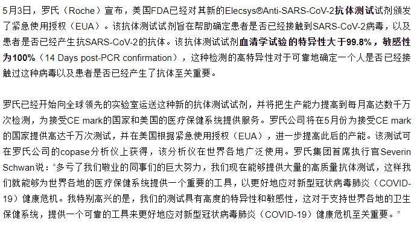

# **CURE-COVID-19**

***

# 全球肺炎实战共享平台

马云公益基金会、阿里巴巴公益基金会、浙江大学附属第一医院联合发起建立的这个全球新冠肺炎实战共享平台，将专注为世界各地的一线医生和护士提供抗疫实战经验分享，方便他们在线交流协作，为相关科研提供AI大数据和计算能力支撑。

**[肺炎实战共享平台](https://covid-19.alibabacloud.com/zh?from=timeline&isappinstalled=0)**

***

***
  
  
- [COVID-19 治疗相关报道](#covid-19-------)
  * [疫情地图](#疫情地图)
  * [检测试剂](#检测试剂)
  * [治疗方案](#治疗方案)
  * [氯喹专题](#氯喹专题)
  * [疫苗相关／新药开发](#疫苗相关／新药开发)
  * [研究进展](#研究进展)
  * [典型病历史报道](#典型病历史报道)
  * [其他](#其他)
  * [妖孽存照 ](#妖孽存照)
  * [其它资料](#其它资料)
  * [相关股票](#相关股票)

# COVID-19 治疗相关报道

 ***

## 疫情地图

- [**See how your community is moving around differently due to COVID-19**](https://www.google.com/covid19/mobility/)

- [**Every Vaccine and Treatment in Development for COVID-19, So Far**](https://www.visualcapitalist.com/every-vaccine-treatment-covid-19-so-far/)

- [**Social Distancing Scoreboard**](https://www.unacast.com/covid19/social-distancing-scoreboard)

- [**COVID Community Vulnerability Map**](https://covid19.jvion.com/)

- [**COVID-19 Projections**](https://covid19.healthdata.org/projections)
   
   Charts below shows projected hospital resource use based on COVID-19 deaths.

- [**2019 Novel Coronavirus - SAS Coronavirus Dashboard**](https://tbub.sas.com/COVID19/)

- [**Should we really stay home?**](https://shouldwereallystayhome.com/)

- [**The COVID Tracking Project**](https://covidtracking.com/data/) &#11088;

- [**Coronavirus COVID-19 Global Cases by the Center for Systems Science and Engineering**](https://coronavirus.jhu.edu/map.html)

- [**Novel coronavirus (COVID-19) outbreak timeline map**](https://www.healthmap.org/covid-19/)

- [**Novel coronavirus infection map**](https://hgis.uw.edu/virus/)

- [**Novel coronavirus (COVID-19) situation dashboard (WHO)**](https://who.maps.arcgis.com/apps/opsdashboard/index.html#/c88e37cfc43b4ed3baf977d77e4a0667)

- [**Coronavirus: the new disease Covid-19 explained**](https://multimedia.scmp.com/infographics/news/china/article/3047038/wuhan-virus/index.html?src=article-launcher)

- [**全球新冠病毒最新实时疫情地图_丁香园**](https://ncov.dxy.cn/ncovh5/view/pneumonia)

- [**北美版丁香园 美国和加拿大 疫情地图实时动态追踪**](https://coronavirus.1point3acres.com/)

 ***
 
## 检测试剂

- [**2020-03-31 2分钟血清学检测获FDA紧急使用授权，腾盛博药合作开发中和抗体**](https://mp.weixin.qq.com/s?__biz=MzAwMDA5NTIxNQ==&mid=2649992739&idx=2&sn=bb30013d2d6aebc8f31b9a46e57e4c0b&chksm=82e928a3b59ea1b504083169967c64e62ece232fe768e7e236a2b49b6246c11a2a2ca225127c&mpshare=1&scene=1&srcid=&sharer_sharetime=1585704914132&sharer_shareid=a95d81bba82caa939c92c4c89cf532d1&exportkey=Al20%2BRB1XWj8%2F%2BTYlpFPspY%3D&pass_ticket=fy6A9NWrSM5GNGsHzIhhDHYvq9KeSlpVx9WfIo0sc56p1KMvSrKCjGYLpYNz%2BKbU#rd)

- [**2020-03-30 新冠病毒诊断检测技术小结**](https://mp.weixin.qq.com/s?__biz=MzI5NzY0NDQyNQ==&mid=2247519174&idx=1&sn=2ec35a220b1bf967e7798a229ab44fca&chksm=ecb33320dbc4ba36cd8f4deb2bdb7a42e26ec956285a705e3e46a3b4ff17f57f3c92477a4796&mpshare=1&scene=1&srcid=&sharer_sharetime=1585617731763&sharer_shareid=a95d81bba82caa939c92c4c89cf532d1&exportkey=AiAU3NSzKBuYVIWhViNYWgc%3D&pass_ticket=U2YJrz72y3VMaoWwFTE3ho56hX0fOl4aePX00Wre4jZGzCGPjqAZd%2FBXGPJBdxOu#rd)

- [**2020-03-29 重大进展！德国博世推出新冠病毒快速检测仪**](https://mp.weixin.qq.com/s?__biz=MzU2MTcxMDgyNQ==&mid=2247485515&idx=1&sn=1d2901469e8964a3c4cc15aa5299d29c&chksm=fc75dbcdcb0252dbfcc9f597df1da5d44ff01cc23862a60502c8085201fd2074358562920942&mpshare=1&scene=1&srcid=&sharer_sharetime=1585398085479&sharer_shareid=a95d81bba82caa939c92c4c89cf532d1&exportkey=AhdYeyC8abnHYql%2BnkgiuPk%3D&pass_ticket=5xCHI5TKTqPvQY9lswcOx6tqGhsYpCflEoy6pG0YI2hlzMBG6pQgJ3KoIJVr7hHR#rd)

- [**2020-03-22 快讯！FDA紧急授权首个新冠病毒POC即时检测产品，最快45分钟出结果**](https://www.wuximediatech.com/content/post/detail.html?sn=bb0f2bf78bca4991a40f8085a5f3f566&from=timeline&isappinstalled=0)

- [**2020-03-21 The First U.S. Company Has Announced an Upcoming Home COVID-19 Test**](https://time.com/5805953/home-covid-19-test-everlywell/)

- [**2020-03-20 A Massively Parallel COVID-19 Diagnostic Assay for Simultaneous Testing of 19200 Patient Samples**](https://docs.google.com/document/d/1kP2w_uTMSep2UxTCOnUhh1TMCjWvHEY0sUUpkJHPYV4/edit)

- [**2020-03-17 中美上市新型冠状病毒检测试剂对比**](https://mp.weixin.qq.com/s?__biz=MzA3ODgzODc5NA==&mid=2651778806&idx=1&sn=241867507717156503d81c7694487f57&chksm=8446e393b3316a856f0b8e5381f13d5b7a401e776b92af57c075d2d71c807d7be6a3721c5280&mpshare=1&scene=1&srcid=0318xetmhIcbKxoRNtN4AmfM&sharer_sharetime=1584492582044&sharer_shareid=a95d81bba82caa939c92c4c89cf532d1&exportkey=Anhhsami5IaqdwlUjPVAtbE%3D&pass_ticket=Ym0fpwqfCHTJOr2fhlHchYZ8NaqDH4zPzxIH4YkaW0zpdzFeWiSxEe6AgNZ1RNSD#rd)

- [**2020-03-14 罗氏 cobas SARS-CoV-2 检测获得FDA紧急使用授权，显著提高新型冠状病毒检测能力**](https://mp.weixin.qq.com/s?__biz=MzAxMjA5ODExMg==&mid=2649767588&idx=1&sn=4258907ea9e07394bec8215b7a35a811&chksm=83b3918bb4c4189d0d4ed717b7600ac9dba3764055c108657cebbe843ede24efb9edeaa74c32&mpshare=1&scene=1&srcid=03181WPcXsMbuTty8hDY8SuP&sharer_sharetime=1584499170738&sharer_shareid=a95d81bba82caa939c92c4c89cf532d1&exportkey=AuBZoeH9Lf35GRebQY31wQQ%3D&pass_ticket=Ym0fpwqfCHTJOr2fhlHchYZ8NaqDH4zPzxIH4YkaW0zpdzFeWiSxEe6AgNZ1RNSD#rd)

 ***
 
## 治疗方案

- [**2020-04-03 治疗COVID-19，NK细胞疗法人体试验获FDA批准**](https://mp.weixin.qq.com/s?__biz=MzU1MTk1NTUwMA==&mid=2247488824&idx=1&sn=f88af90b4fa92570f37ab5db8c45b719&chksm=fb88287bccffa16d5861e4171b5e5b99c78515ab2583407dc45f2e1d8be47a23331493448005&mpshare=1&scene=1&srcid=&sharer_sharetime=1585922680577&sharer_shareid=c5f5665a79f5ff6af10252303d5b126f&exportkey=Al08flfesyTSS45%2FpiGYFwg%3D&pass_ticket=eWvwUin4xExXuTRzPaREucuFHTu4NL6ZUVTfDVaGQg87cKpMxDVnMGKgSobcBzCD#rd)

- [**2020-03-27 瑞德西韦临床试药者：久治不愈，“就想试一试”**](https://mp.weixin.qq.com/s?__biz=MjM5MzI5NTU3MQ==&mid=2651613637&idx=4&sn=320aa7ea25b0d5055d732d7338b5690c&chksm=bd61f4798a167d6f48df99d75e123fc98b1bb24b742a131e788f1d7a63aee648b835d22c9b41&mpshare=1&scene=1&srcid=&sharer_sharetime=1585350097449&sharer_shareid=a95d81bba82caa939c92c4c89cf532d1&exportkey=Aqby%2FImty0I3IdErbVYO7pg%3D&pass_ticket=Z3621RgbKGrRiRFU7k%2FCxsE7nw4MPKqnJos9MxJS%2FlZHGdC97UydMWjbNZt0nsbS#rd)

- [**2020-03-26 Bahrain, Belgium report coronavirus treatment touted by Trump is working for patients**](https://justthenews.com/politics-policy/coronavirus/bahrain-hydroxychloroquine-success-response-covid-19#.XnvXrFFGkI4.twitter)

- [**2020-03-25 达诺瑞韦治疗初治和经治新冠肺炎患者的首个临床研究结果发表**](https://mp.weixin.qq.com/s?__biz=MzU2MTcxOTAwMw==&mid=100012283&idx=1&sn=1e951878a490d66210fa205e5d733d2e&chksm=7c76c34f4b014a59cfdf95f2d985b8ac3f8cbee4432b26187a67da65234284901fed4ec264d9&mpshare=1&scene=1&srcid=0325UvMeWCZ42quTXTBCdTtw&sharer_sharetime=1585102317900&sharer_shareid=a95d81bba82caa939c92c4c89cf532d1&exportkey=Avyi7qVcRdm1ijylGAszW1c%3D&pass_ticket=TwDSjqO7XaG662lS0nEWFoR5WsGvAzyojkmNY2w6BZh12zPI8QJAhn92AQoew%2BrC#rd)

- [**2020-03-24 从 PK/PD 角度浅谈新冠肺炎患者治疗中奈诺沙星用药方案合理性**](https://mp.weixin.qq.com/s?__biz=MTg0MzMwODA0MQ==&mid=2653375398&idx=2&sn=a8efac05c4ff04d0ca3148ec7fe4ea19&chksm=5e32bac0694533d6aca58997b721067d1cdd8f11fa063b47f905ea38b02e7a0cf775342db7fa&mpshare=1&scene=1&srcid=&sharer_sharetime=1585010568679&sharer_shareid=a95d81bba82caa939c92c4c89cf532d1&exportkey=AilIOYxAtMwO1E%2FUzm90C7o%3D&pass_ticket=AffHC52GB9HY5n%2BDrR8AjuY2CbTqEkbsgvAIn9%2FRHzOlhwSlxqPxxEt7Kshiv8Pq#rd) 

- [**2020-03-22 法匹拉韦治疗COVID-19最新临床数据！疗效强于阿比朵尔，推荐为普通型患者首选治疗**](https://mp.weixin.qq.com/s?__biz=MzU1MTk1NTUwMA==&mid=2247488648&idx=1&sn=265db913d632ff033e10aaf796bd3fec&chksm=fb8829cbccffa0dd505ea602c564f81f909c4789214ac6da39ecb5354a2ddd7dbdc8c14d0232&mpshare=1&scene=1&srcid=&sharer_sharetime=1584891490413&sharer_shareid=c5f5665a79f5ff6af10252303d5b126f&exportkey=AgCTTnWmTg7Vtz6feLcNsNk%3D&pass_ticket=R04LIHTo9Hcxmbaoq%2Bhvk9GLtI4Eo8hQJLqKMag61uoeW49PRPJk%2FdmMRjXw6RKe#rd)

- [**2020-03-19 FDA Announces Two Drugs Approved for ‘Compassionate Use’ in Treating COVID-19**](https://www.pharmacytimes.com/news/fda-announces-two-drugs-approved-for-compassionate-use-in-treating-covid-19?from=timeline&isappinstalled=0)

- [**2020-03-19 《柳叶刀》：抗击疟疾耐药！青蒿素三联疗法安全有效，八国试验支持“现成新选择”**](https://mp.weixin.qq.com/s?__biz=MzAxOTU2OTU4MQ==&mid=2649914444&idx=1&sn=81e64fd62e00ca24685a4a46b28b88a9&chksm=83c3d28eb4b45b982607257e82467414422413209005a038d45f3361b24a65b6cae89a469626&mpshare=1&scene=1&srcid=&sharer_sharetime=1584631681034&sharer_shareid=a9c952ab6f63a17519bb96b39232e47e&exportkey=Ashr9%2FZrKtywenwn00lVf1k%3D&pass_ticket=QVc%2BaIiodq8ErwN1pzyLkkQt3E8FKT9U6n%2BhlSiB9UjrSqz9%2FdqAOv4oPluzeLwh#rd)

- [**2020-03-19 NEJM重磅 | 随机对照研究，王辰院士等揭示洛匹那韦–利托那韦治疗重症新冠肺炎无效**](https://mp.weixin.qq.com/s?__biz=MzU3MTE3MjUyOA==&mid=2247507768&idx=3&sn=84c66d44de6c56cb16c7f3ced95e6502&chksm=fce6ace7cb9125f15cc0bcda0551eac8683914b548e325b5a0fef3a3cc08fd3504628c23ed77&mpshare=1&scene=1&srcid=&sharer_sharetime=1584582466849&sharer_shareid=a95d81bba82caa939c92c4c89cf532d1&exportkey=Ah76d9fDSGUDGIYnc1z%2BIH0%3D&pass_ticket=zWVYVxV8%2FgP9pcTskTZ3kJK2M8M7CIt2zKwqd%2FuyaF7zWd5K0R%2BUKfTp4dSrfWX8#rd)

- [**2020-03-18 Japanese flu drug 'clearly effective' in treating coronavirus, says China**](https://www.theguardian.com/world/2020/mar/18/japanese-flu-drug-clearly-effective-in-treating-coronavirus-says-china)

- [**2020-03-18 直接比较候选疗法疗效，世卫组织启动大型全球性COVID-19临床试验**](https://mp.weixin.qq.com/s?__biz=MzAwMDA5NTIxNQ==&mid=2649992335&idx=1&sn=297d49e5094715a0c0c106adc8310bfc&chksm=82e92a0fb59ea31918a7ffcbd96b9b9cf7c7a0612b48ac23032132741bcd489f8cf71339d865&mpshare=1&scene=1&srcid=&sharer_sharetime=1584574344481&sharer_shareid=7aebabece500f47b2bda8614435da29f&exportkey=AiLoVnqqZ7L7DAn%2Bkk7d6Xo%3D&pass_ticket=zWVYVxV8%2FgP9pcTskTZ3kJK2M8M7CIt2zKwqd%2FuyaF7zWd5K0R%2BUKfTp4dSrfWX8#rd)

- [**2020-03-15 韩国在救治新冠肺炎病患中异军突起**](http://www.360doc.cn/article/1120683_899395057.html)

- [**2020-03-13 日本结果显示remdesivir ( 人民的希望） 对新冠状病毒重症100%有效**](https://mp.weixin.qq.com/s?__biz=MzA5MTI5MDY5Mg==&mid=2649570394&idx=1&sn=14a024fcc63b0b59b800dbee7279be32&chksm=88673171bf10b867c58efb5c0e0cc2bcdf6deb83e88c125e22bc74e4a236690e8ecf8d23ad87&mpshare=1&scene=1&srcid=0314bluSprgg77Lzm7QoPiLT&sharer_sharetime=1584499454786&sharer_shareid=a95d81bba82caa939c92c4c89cf532d1&exportkey=Ao9MAMZPymM%2B%2F4dQHj1eCgI%3D&pass_ticket=Ym0fpwqfCHTJOr2fhlHchYZ8NaqDH4zPzxIH4YkaW0zpdzFeWiSxEe6AgNZ1RNSD#rd)

- [**2020-03-12 从柳叶刀最新论文看新冠病毒的一些临床特点**](https://mp.weixin.qq.com/s?__biz=MzA3MjA5ODY1Mg==&mid=2658067545&idx=1&sn=5094fa06b961e28c6291afcdbb1b27b1&chksm=84b9326ab3cebb7c45ec8532fa3b889062c81f587828cddfc3bebca3911fb53bc1e50eb901c3&mpshare=1&scene=1&srcid=0318uPeqTqQ8WGx2kZo2O5PJ&sharer_sharetime=1584499340077&sharer_shareid=a95d81bba82caa939c92c4c89cf532d1&exportkey=AuN2XTaZCeQyD8fFZIHc0hY%3D&pass_ticket=Ym0fpwqfCHTJOr2fhlHchYZ8NaqDH4zPzxIH4YkaW0zpdzFeWiSxEe6AgNZ1RNSD#rd)

- [**2020-03-11 UC Davis Medical Center successfully treats patients with coronavirus; hospital plans to expand on-site testing**](https://health.ucdavis.edu/health-news/newsroom/UC-Davis-Medical-Center-successfully-treats-coronavirus-patients-hospital-plans-on-site-testing/2020/03?fbclid=IwAR0nx4lOlO8IPFrndv2pGMo5djlLke9KqE5HpRhVHVQNKSss0yUKslC0Diw&from=groupmessage&isappinstalled=0#.Xmzs6qkpkOG.facebook)

 ***
 
## 氯喹专题

- [**2020-04-01 Malaria Drug Helps Virus Patients Improve, in Small Study**](https://www.nytimes.com/2020/04/01/health/hydroxychloroquine-coronavirus-malaria.html)

- [**2020-03-30 C&EN深度：如何看待氯喹/羟氯喹治疗COVID-19的研究进展？**](https://mp.weixin.qq.com/s?__biz=MzUxMTY5MzM5OQ==&mid=2247493219&idx=1&sn=b54927cc87843cd9d7cb4d57544db3d6&chksm=f96d615bce1ae84d167025f3934761e8d328bbac4e2385c85fce41a48b233690eb0e889072e7&mpshare=1&scene=1&srcid=&sharer_sharetime=1585524118021&sharer_shareid=a95d81bba82caa939c92c4c89cf532d1&exportkey=Alknqo37T%2BQACacpx9kVL7o%3D&pass_ticket=U2YJrz72y3VMaoWwFTE3ho56hX0fOl4aePX00Wre4jZGzCGPjqAZd%2FBXGPJBdxOu#rd)

- [**2020-03-30 FDA issues emergency authorization of anti-malaria drug for coronavirus care**](https://www.politico.com/news/2020/03/29/fda-emergency-authorization-anti-malaria-drug-155095)

- [**2020-03-29 吃氯喹防新冠？英国牛津大学启动万人临床试验**](https://mp.weixin.qq.com/s?__biz=MzA3NTIyODUzNA==&mid=2649584596&idx=1&sn=bfc77e98acb19535606114ce01749ea3&chksm=876a67cdb01deedb11a53e16a261e965bc17f181053b77fc8b21d937cfbdd71abfac747c0cec&mpshare=1&scene=1&srcid=&sharer_sharetime=1585370721977&sharer_shareid=a95d81bba82caa939c92c4c89cf532d1&exportkey=Ap14gsgJoG%2Bx8HL8fWahUCM%3D&pass_ticket=5xCHI5TKTqPvQY9lswcOx6tqGhsYpCflEoy6pG0YI2hlzMBG6pQgJ3KoIJVr7hHR#rd)

- [**2020-03-25 特朗普力推的「羟氯喹」，你知道它该怎么用吗？**](https://mp.weixin.qq.com/s?__biz=MjM5MjgwOTI5MQ==&mid=2650208001&idx=1&sn=a922d6fa558fa9204fd71dc0262f5193&chksm=bea2ff2589d57633d1ef2c10bc3d9f7652b362fcee41177523fa3f7d51344fddb63d16d6ff60&mpshare=1&scene=1&srcid=&sharer_sharetime=1585185941819&sharer_shareid=a95d81bba82caa939c92c4c89cf532d1&exportkey=AkT3iPSIvxcrUW0rn4SHS2o%3D&pass_ticket=TwDSjqO7XaG662lS0nEWFoR5WsGvAzyojkmNY2w6BZh12zPI8QJAhn92AQoew%2BrC#rd)

- [**2020-03-22 治疗新冠肺炎，羟氯喹是否比氯喹更合适？**](https://mp.weixin.qq.com/s?__biz=MjM5MDIzMDMwMA==&mid=2656138895&idx=1&sn=f13ef7825f8c3aec3364addfca0bf810&chksm=bde224fc8a95adea7d3d219b4d96d0870678e72416abc8ef0ccbd8b886a0c976192f3c7f5531&mpshare=1&scene=1&srcid=&sharer_sharetime=1584901602016&sharer_shareid=a95d81bba82caa939c92c4c89cf532d1&exportkey=Anr5TSjuxexdj%2B%2BIrT0RQVI%3D&pass_ticket=yGq308KHjldfGusEXTm2PrdOta2h0OxvbMk%2BUUMwX7Hb%2F15kFTisCmMIo%2FavfNHW#rd)

- [**2020-03-22 “穷人的希望” — 奎宁、氯喹、羟氯喹的前世今生**](https://mp.weixin.qq.com/s?__biz=MzI3MTIxNTgyMw==&mid=2651589314&idx=1&sn=59f78974eb2a2bf63ca8a14d51c38b76&chksm=f13d9762c64a1e74d055b021e9f1efcd1b69b06057f9b99e8140a32d05be8a1d41f151df442e&mpshare=1&scene=1&srcid=&sharer_sharetime=1584846116200&sharer_shareid=a95d81bba82caa939c92c4c89cf532d1&exportkey=ArDGGlX0emqTOk0boaIzVWc%3D&pass_ticket=R04LIHTo9Hcxmbaoq%2Bhvk9GLtI4Eo8hQJLqKMag61uoeW49PRPJk%2FdmMRjXw6RKe#rd)

- [**2020-03-18 英国启动万人试验：COPCOV (警察抓新冠) - 氯喹预防新冠肺炎的研究**](https://mp.weixin.qq.com/s?__biz=MzUxODkzOD**QxMA==&mid=2247488248&idx=2&sn=dff4d5861d3381a0741c9200b62a32fc&chksm=f98018bdcef791ab49e3b2e111896d06c80c5c7b4160f91b3bb7133dc0d13f9a74d2feb75fec&mpshare=1&scene=1&srcid=0319GJUYbt7n85e3cYSvD2Dn&sharer_sharetime=1584580213616&sharer_shareid=b68d8317789f29dcf2f5879eed2cdff5&exportkey=AnmXigczTeo%2Fbe1X8LdH2jQ%3D&pass_ticket=zWVYVxV8%2FgP9pcTskTZ3kJK2M8M7CIt2zKwqd%2FuyaF7zWd5K0R%2BUKfTp4dSrfWX8#rd)

- [**2020-03-18 After 6 days 100% of patients treated with HCQ + Azithromycin  were virologically cured**](https://twitter.com/RiganoESQ/status/1240273631604809728) 

- [**An Open Data Clinical Trial for COVID-19 Prevention**](https://www.covidtrial.io/)

- [**20202-03-10 磷酸氯喹、羟氯喹及双氢青蒿素哌喹片：老牌抗疟药的抗新冠肺炎之路**](https://mp.weixin.qq.com/s?__biz=MzA5MjEzODQ3NA==&mid=2655775100&idx=1&sn=65ca8f9e49d6ae1ec832298a0700d335&chksm=8bcef7f9bcb97eeffb7c13146eae4b03ef8d261fb650f1f2bf22962285562d6446657d2e99b2&mpshare=1&scene=1&srcid=0318r5iFNTA29QGzMb48IWjv&sharer_sharetime=1584499661380&sharer_shareid=a95d81bba82caa939c92c4c89cf532d1&exportkey=AtivEd5X6cbq%2FNo5J1mqI1E%3D&pass_ticket=Ym0fpwqfCHTJOr2fhlHchYZ8NaqDH4zPzxIH4YkaW0zpdzFeWiSxEe6AgNZ1RNSD#rd)

 ***

## 疫苗相关／新药开发

- [**2020-04-05 ANTI-PARASITE DRUG USED SINCE 1980S MAY HELP STOP CORONAVIRUS, NEW STUDY SAYS**](https://www.newsweek.com/anti-parasite-drug-used-since-1980s-may-help-stop-coronavirus-new-study-says-1496083) &#127381; 

- [**2020-04-04 Common Anti-Parasite Drug May Kill Coronavirus in Under 48 Hours, Say Researchers**](https://www.breitbart.com/border/2020/04/04/common-anti-parasite-drug-may-kill-coronavirus-in-under-48-hours-say-researchers/) &#127381; 

- [**2020-04-04 新冠疫苗“皮肤贴片”！有效诱导抗体产生，正在申请人体试验**](https://mp.weixin.qq.com/s?__biz=MzU1MTk1NTUwMA==&mid=2247488838&idx=1&sn=0b7f51b21b0a1612d49ac8ffcdbfc100&chksm=fb882805ccffa113c13e507452a6ee2ac2c6bc6059fd45d5f18189b32d55f7a55436595ea5ab&mpshare=1&scene=1&srcid=&sharer_sharetime=1586016278463&sharer_shareid=c5f5665a79f5ff6af10252303d5b126f&exportkey=Ag9Iozpmb8sRTl3RAa5RZbo%3D&pass_ticket=5K2ZRKaQOEPLCyMglaCTl9QJTZGUpOwZywBq4rZnPjTKyvFKdnExJZY0fmkQekEI#rd) &#127381; 

- [**2020-04-02 强生承诺向全球提供10亿剂新冠疫苗，与美国政府合作豪赌10亿美元**](https://mp.weixin.qq.com/s?__biz=MzU1MTk1NTUwMA==&mid=2247488812&idx=1&sn=9f02fbc5fd50293286bb250395dba469&chksm=fb88286fccffa17998e657ec18d03482ac162aed50edf4afe3dc9584ba4bce931c8f63caeecc&mpshare=1&scene=1&srcid=&sharer_sharetime=1585838402486&sharer_shareid=a95d81bba82caa939c92c4c89cf532d1&exportkey=AnDphZO9S14OK8ONfx%2BLBn0%3D&pass_ticket=b3Vb%2BxtTSi8vvLXKyll7zXgI3xCd%2FEI6E30air%2BCFdB8iX4%2FKKTlkLIj%2BdqMyJ8E#rd)

- [**2020-04-02 Coronavirus: Pittsburgh Scientists Detail Potential Vaccine**](https://patch.com/pennsylvania/pittsburgh/potential-coronavirus-vaccine-details-disclosed)

- [**2020-03-31 IL-6受体抑制剂治疗新冠肺炎！赛诺菲/再生元Kevzara全球项目美国以外地区首例患者接受治疗！**](https://mp.weixin.qq.com/s?__biz=Mzg3OTE3NjA4Nw==&mid=2247485966&idx=6&sn=3e8e928a6b99834a35e02dd64643c273&chksm=cf093af6f87eb3e0672c32d3e0c61c70adff16ce570dc4fd0a5fa7c005de4515bb44cad35dbd&mpshare=1&scene=1&srcid=&sharer_sharetime=1585664548449&sharer_shareid=a95d81bba82caa939c92c4c89cf532d1&exportkey=AnaHcbGqs9%2FAAeaeOkzf7lk%3D&pass_ticket=fy6A9NWrSM5GNGsHzIhhDHYvq9KeSlpVx9WfIo0sc56p1KMvSrKCjGYLpYNz%2BKbU#rd)

- [**2020-03-31 Johnson & Johnson Announces a Lead Vaccine Candidate for COVID-19**](https://www.jnj.com/johnson-johnson-announces-a-lead-vaccine-candidate-for-covid-19-landmark-new-partnership-with-u-s-department-of-health-human-services-and-commitment-to-supply-one-billion-vaccines-worldwide-for-emergency-pandemic-use?from=timeline&isappinstalled=0)

- [**2020-03-29 CD147抗体临床试验数据发布！有效改善COVID-19患者康复，安全性良好**](https://mp.weixin.qq.com/s?__biz=MzU1MTk1NTUwMA==&mid=2247488746&idx=1&sn=d70517da81b81f121ce93240e057f7fc&chksm=fb8829a9ccffa0bf213f8d4b878633c9a3a882214ff8df5bedfe3fa0008ee635f08d16fe6068&mpshare=1&scene=1&srcid=&sharer_sharetime=1585492326831&sharer_shareid=a95d81bba82caa939c92c4c89cf532d1&exportkey=AnM94Odt9BfCUNPXK3Suosw%3D&pass_ticket=5xCHI5TKTqPvQY9lswcOx6tqGhsYpCflEoy6pG0YI2hlzMBG6pQgJ3KoIJVr7hHR#rd)

- [**2020-03-29 【回顾】抗病毒药物50年批准史**](https://mp.weixin.qq.com/s?__biz=MzA5NTExNTIxNw==&mid=2651268784&idx=1&sn=d53f2ac3c70a643f0a565d97fd4f7380&chksm=8bb7c40ebcc04d183229d7d035445f69d173b22a498a9dc67bd4ebf260576957b03775ed8815&mpshare=1&scene=1&srcid=&sharer_sharetime=1585401402734&sharer_shareid=a95d81bba82caa939c92c4c89cf532d1&exportkey=Ah%2BuWnygzaFyKorXtA7taaA%3D&pass_ticket=5xCHI5TKTqPvQY9lswcOx6tqGhsYpCflEoy6pG0YI2hlzMBG6pQgJ3KoIJVr7hHR#rd)

- [**2020-03-25 FDA对于疫情期间临床试验的执行提供建议**](https://mp.weixin.qq.com/s?__biz=MzI0ODQ4MzM0MQ==&mid=2247494096&idx=1&sn=0ba0d6ee1f4ce5c7cbc074bf0a1ced5f&chksm=e9a2b2b2ded53ba4656ac21a8f49d8b1aacd628182dc5437ad367d78811e72dfe8a68cb9ac19&mpshare=1&scene=1&srcid=&sharer_sharetime=1585087518266&sharer_shareid=a95d81bba82caa939c92c4c89cf532d1&exportkey=Al8K1lOzrKtxK2NmmJ%2F%2FKiI%3D&pass_ticket=TwDSjqO7XaG662lS0nEWFoR5WsGvAzyojkmNY2w6BZh12zPI8QJAhn92AQoew%2BrC#rd)

- [**2020-03-24 【快报】瑞德西韦刚刚获得治疗新冠肺炎孤儿药认证**](https://mp.weixin.qq.com/s?__biz=MzUxODkzODQxMA==&mid=2247488337&idx=3&sn=a2a7e4c092248b2d66111f6302279b35&chksm=f9801914cef79002a9b50342457c44b1d748855b175f0bafda6c0de90c8590320f8e85f49e88&mpshare=1&scene=1&srcid=0324g8mZFJ3rheo9Smf8R1Xx&sharer_sharetime=1585009795426&sharer_shareid=b68d8317789f29dcf2f5879eed2cdff5&exportkey=AlItbKzwojfYN4f%2F9pRtPEs%3D&pass_ticket=AffHC52GB9HY5n%2BDrR8AjuY2CbTqEkbsgvAIn9%2FRHzOlhwSlxqPxxEt7Kshiv8Pq#rd)

- [**2020-03-24 Gilead's potential coronavirus treatment gets FDA's orphan drug label**](https://www.reuters.com/article/us-health-coronavirus-gilead-sciences-idUSKBN21A3PR) 

- [**2020-03-22 疫苗之战：史上最劲爆的中美“军备竞赛”，一年成功可能并非天方夜谭**](https://mp.weixin.qq.com/s?__biz=MzA3NzIxNzI4Mw==&mid=2671004611&idx=3&sn=eb1d63668ecec080901e888cb8c9b620&chksm=859580afb2e209b916a1b9d9b1b1eeb8d97593c274071303c866cf58c86507a1ba45264f7724&mpshare=1&scene=1&srcid=&sharer_sharetime=1584891275842&sharer_shareid=a95d81bba82caa939c92c4c89cf532d1&exportkey=AnnyzfHr%2FaLV8rU8sC7uMG0%3D&pass_ticket=R04LIHTo9Hcxmbaoq%2Bhvk9GLtI4Eo8hQJLqKMag61uoeW49PRPJk%2FdmMRjXw6RKe#rd)

- [**2020-03-21 美国的新冠病毒疫苗，为何这么快就开始了临床试验？原因很简单**](https://mp.weixin.qq.com/s?__biz=MzAwMzc2MTA4Ng==&mid=2247498422&idx=2&sn=7b46f0f3a35cbf5aea7a100dc841e4ed&chksm=9b348c67ac430571ae167fedc2d3f6e82f9cadf69a5f06a81c1f62a3840b3b28a278621b01ac&mpshare=1&scene=1&srcid=&sharer_sharetime=1584814667112&sharer_shareid=a95d81bba82caa939c92c4c89cf532d1&exportkey=AiiQlEquowslLUoA%2Bx1Q3f8%3D&pass_ticket=xBFLpLZDtf4fOQT3V9iQFywMTX9TkxF6uyqpwgnZUqMEdmxagWy7FTBcqFQ6LTU5#rd)

- [**2020-03-21 中国新冠病毒疫苗已注射进人体，I期试验志愿者仅限武汉居民**](https://mp.weixin.qq.com/s?__biz=MjIyNDQ5Nzc4MQ==&mid=2650867452&idx=1&sn=6d9d875803685113a8cf852cc9ac9d17&chksm=b75d75e6802afcf071354a7ce9c29a5016894132155dc15eb1833f2afaaf9c5eabfd0b681b07&mpshare=1&scene=1&srcid=&sharer_sharetime=1584798544478&sharer_shareid=a95d81bba82caa939c92c4c89cf532d1&exportkey=AnADIYapbVzAnwUS2DxjnwI%3D&pass_ticket=xBFLpLZDtf4fOQT3V9iQFywMTX9TkxF6uyqpwgnZUqMEdmxagWy7FTBcqFQ6LTU5#rd)

- [**2020-03-20 Nature提出5个新冠疫苗开发的关键问题**](https://mp.weixin.qq.com/s?__biz=MzIzMTY2MTAzMA==&mid=2247487587&idx=1&sn=ec0a50fb41730cbe7bd32b133885c180&chksm=e8a19ceadfd615fcbf44b9f16f0c85b9888ee0ca84fb0e4f107d38849c03a4e61f2b3fe6620f&mpshare=1&scene=1&srcid=&sharer_sharetime=1584694780213&sharer_shareid=a7e32da51bd8652bf82fc868cc3dfc99&exportkey=ArM5YlG4bnru2jGA0z8WSDs%3D&pass_ticket=SwNVSziXYg%2B39Yug6qtVhPmKUap2vRoCaNfWY0Hz0mZcQW0ICYv1W18i7wQNgYf6#rd)

- [**2020-03-19 An Effective Treatment for Coronavirus (COVID-19)](https://docs.google.com/document/d/e/2PACX-1vTi-g18ftNZUMRAj2SwRPodtscFio7bJ7GdNgbJAGbdfF67WuRJB3ZsidgpidB2eocFHAVjIL-7deJ7/pub)

- [**2020-03-19 罗氏启动托珠单抗治疗重症COVID-19肺炎患者III期研究：招募330例患者**](https://mp.weixin.qq.com/s?__biz=MzA4MDA4MTIzMg==&mid=2653069451&idx=2&sn=16675ccd88483a21351f9c4e04125145&chksm=847fb8b4b30831a2f3434784e906afa6e496dc40f2fbe85050a07022fc8f142735d9526eee1e&mpshare=1&scene=1&srcid=&sharer_sharetime=1584659771876&sharer_shareid=a95d81bba82caa939c92c4c89cf532d1&exportkey=Atz40SPnsJzKmmqDoh1wXE0%3D&pass_ticket=8w0c%2FEMdX6%2Fj%2B6LnpiniQRWg1OgK%2BgY7vurlya0icShWG%2FfD9eCO0a39Eh2KzF5x#rd)

- [**2020-03-19 新冠疫苗，横空出世了吗？**](https://mp.weixin.qq.com/s?__biz=MzI5NTc5MTI3Nw==&mid=2247483909&idx=1&sn=06adf58ff3fc759bf3a8bc55ff77aeae&chksm=ec4f7dc7db38f4d1ee7c8bd25095abc0c59e7e6cde0c2011b625bf05ee21a8e1feb6295975c0&mpshare=1&scene=1&srcid=&sharer_sharetime=1584633862070&sharer_shareid=470b615c30870b5523881592816e9b3e&exportkey=ArEs7EJ6KBoly923Q1qLmCM%3D&pass_ticket=QVc%2BaIiodq8ErwN1pzyLkkQt3E8FKT9U6n%2BhlSiB9UjrSqz9%2FdqAOv4oPluzeLwh#rd)

- [**2020-03-19 医药创新界联署：解决新冠病毒等疫苗、药物研发停滞问题**](https://mp.weixin.qq.com/s?__biz=MzA5MTA2MDIxOQ==&mid=2247484099&idx=1&sn=41f1d63734d8a2e1391dfb1fca7fa89c&chksm=90036057a774e941b9e1656fa444976cef0f3b8873f6fac1f22d705934f36a94df628c6ee0d1&mpshare=1&scene=1&srcid=&sharer_sharetime=1584611272328&sharer_shareid=ccc7e15e8277d725ef3ca0c0363c259b&exportkey=AnidKXFyTvwzUGtVC7GwiyM%3D&pass_ticket=SmpVjidc%2Bpb9lRtyO5kZVjon%2Bxx1yNJOKkKHz58ZrkdkebmsPahazPlCwcHVdiXM#rd)

- [**2020-03-19 快讯！罗氏启动首个托珠单抗治疗新冠肺炎全球3期临床试验**](https://www.wuximediatech.com/content/post/detail.html?sn=8e7e6b5d1**48d435fa3285776f04fad9d&from=wechat)

- [**2020-03-18 Coronavirus vaccines: five key questions as trials begin**](https://www.nature.com/articles/d41586-020-00798-8)

- [**2020-03-18 新冠病毒重要药物靶点-RNA依赖的RNA聚合酶三维精细结构获得解析**](https://mp.weixin.qq.com/s?__biz=MjM5NTY5OTMxMA==&mid=2651311956&idx=1&sn=fe7b925bed54be440e8fab3fe0abee51&chksm=bd07e0558a706943da71ebf4b630ad0a4e4ae6c89440fc87478e659ad68dbb7d8b1c1e7ed7e1&mpshare=1&scene=1&srcid=&sharer_sharetime=1584563423612&sharer_shareid=a95d81bba82caa939c92c4c89cf532d1&exportkey=Au0JvES7EgSjwM%2BgI%2F8aJ2Y%3D&pass_ticket=I28Db8P7PMyKR5Lzw0ixxIajuVaMzahzUszVfVQGxr97QzRBKo%2By7BliS5XCSlsk#rd)

- [**2020-03-18 科技部：法匹拉韦完成临床研究，显示出很好的临床疗效，药品已实现量产**](https://mp.weixin.qq.com/s?__biz=MzAwODA5MjQ3Ng==&mid=2653089989&idx=1&sn=33b7bc6f866fb4ab04f32cb083c33f7a&chksm=80a27e96b7d5f780bb028c36fb08432811509324cf4e5698f2678ab15eb8a9c7febf92aab42d&mpshare=1&scene=1&srcid=0317Wh0ClXED19ytl3WO6Liq&sharer_sharetime=1584501785128&sharer_shareid=a95d81bba82caa939c92c4c89cf532d1&exportkey=AlDnjBcl3%2BmL%2F%2BhvY2gJg%2FM%3D&pass_ticket=Ym0fpwqfCHTJOr2fhlHchYZ8NaqDH4zPzxIH4YkaW0zpdzFeWiSxEe6AgNZ1RNSD#rd)

- [**2020-03-18 重磅 | 饶子和院士等团队首次解析了瑞德昔韦标靶的结构，对于药物开发意义重大**](https://mp.weixin.qq.com/s?__biz=MzU3MTE3MjUyOA==&mid=2247507736&idx=2&sn=1d3ae0cf96a74d9d1da0a75be8e45e21&chksm=fce6acc7cb9125d1aac3b1ec166c99ad343634ce28f037b1028f32373a571bb5427cff932cca&mpshare=1&scene=1&srcid=&sharer_sharetime=1584501378606&sharer_shareid=a95d81bba82caa939c92c4c89cf532d1&exportkey=AgYJoto1vy5l3Kc%2Bi21dI5g%3D&pass_ticket=Ym0fpwqfCHTJOr2fhlHchYZ8NaqDH4zPzxIH4YkaW0zpdzFeWiSxEe6AgNZ1RNSD#rd)

- [**2020-03-17 国务院联防联控发布会：法匹拉韦临床疗效明确，已有8种疫苗进行有效性评价**](https://mp.weixin.qq.com/s?__biz=MzU2MTcxOTAwMw==&mid=2247495666&idx=1&sn=aefb3efc3f3c35e229dd795ad8756fcf&chksm=fc76dc46cb0155505bf6a068f3becb2a39b90527b82de66e2b232619a34fed40ee0220f45c98&mpshare=1&scene=1&srcid=&sharer_sharetime=1584496848014&sharer_shareid=a95d81bba82caa939c92c4c89cf532d1&exportkey=AtiUegClNbs%2B%2FQ0M9WLQGjg%3D&pass_ticket=Ym0fpwqfCHTJOr2fhlHchYZ8NaqDH4zPzxIH4YkaW0zpdzFeWiSxEe6AgNZ1RNSD#rd)

- [**2020-03-16 重磅|康希诺生物新冠疫苗进入临床试验招募阶段！**](https://mp.weixin.qq.com/s?__biz=MzI4OTIzMzcwMw==&mid=2659320076&idx=2&sn=50075531d1b58f676ac3dab8444861a5&chksm=f744ef44c03366523e5f4dbb0d527405e35f485d7345bc067ecae68c1feee4732d700728c069&mpshare=1&scene=1&srcid=0318yCwSHpA56JZwEOlr3J3G&sharer_sharetime=1584492754342&sharer_shareid=a95d81bba82caa939c92c4c89cf532d1&exportkey=Avu9z%2FuymCwRdFmhBHGGydY%3D&pass_ticket=Ym0fpwqfCHTJOr2fhlHchYZ8NaqDH4zPzxIH4YkaW0zpdzFeWiSxEe6AgNZ1RNSD#rd)

- [**2020-03-17 康希诺生物全国首款重组新型冠状病毒疫苗获批进入临床**](https://mp.weixin.qq.com/s?__biz=MzI0Nzc5MDU4OQ==&mid=2247483963&idx=1&sn=5511849497d6e65abf843780068b17e5&chksm=e9abeca9dedc65bf03d7a59ff57d33eb5178350db36f32b4b02d8bd727d36f6d240dee50e785&mpshare=1&scene=1&srcid=&sharer_sharetime=1584496562702&sharer_shareid=a95d81bba82caa939c92c4c89cf532d1&exportkey=Alcx7stNO%2Fwzud2qt%2FhA0Po%3D&pass_ticket=Ym0fpwqfCHTJOr2fhlHchYZ8NaqDH4zPzxIH4YkaW0zpdzFeWiSxEe6AgNZ1RNSD#rd)

- [**2020-03-17 再生元已鉴定数百种新冠病毒中和抗体，有望下月进入临床**](https://mp.weixin.qq.com/s?__biz=MzI5OTAyOTI1Ng==&mid=2247483964&idx=1&sn=dc16f2998761ee4fd400a3cb1bf5b12f&chksm=ec9d845bdbea0d4daca5ecfc9a7e2580c7e9f506aa8c2965b419c492fca526a835535d5ed745&mpshare=1&scene=1&srcid=&sharer_sharetime=1584495733288&sharer_shareid=a95d81bba82caa939c92c4c89cf532d1&exportkey=ApHWUQi7gxVafMZZ1HF1vyE%3D&pass_ticket=Ym0fpwqfCHTJOr2fhlHchYZ8NaqDH4zPzxIH4YkaW0zpdzFeWiSxEe6AgNZ1RNSD#rd)

- [**2020-03-17 我国疫苗研发属于国际先进行列，不会慢于国外**](https://news.html5.qq.com/share/1237309093773132098?cardmode=1&ch=060000&dataSrc=96&docId=1237309093773132098&from=timeline&isappinstalled=0&pid=1&qbredirect=&queryId=1584434838014&sc_id=7OqxzeD&sh_sid=5__25bda8df21827333__a7f844b04b6a4ecb13644c6913b788cb&share=true&share_count=2&subjectId=12307&url=http%3A%2F%2Fkuaibao.qq.com%2Fs%2F20200317A0ISG200&zimeitiId=qeh_5109679)

- [**2020-03-17 重磅！军队成功研制重组新冠疫苗**](http://www.mod.gov.cn/topnews/2020-03/17/content_4862066.htm?from=timeline&isappinstalled=0)

- [**2020-03-17 中美德mRNA新冠疫苗研发竞赛，中国何时用上？**](https://news.html5.qq.com/share/5984103083725543746?cardmode=1&ch=060000&dataSrc=96&docId=5984103083725543746&from=timeline&isappinstalled=0&pid=1&qbredirect=&queryId=1584435537021&sc_id=dfjJNuD&sh_sid=5__25bda8df21827333__a7f844b04b6a4ecb13644c6913b788cb&share=true&share_count=2&subjectId=1041601&url=http%3A%2F%2Fkuaibao.qq.com%2Fs%2F20200317A0E8ZO00&zimeitiId=qeh_1654)

- [**2020-03-16 上海市科委：新冠疫苗已启动灵长类动物实验，预计4月中旬临床试验**](https://mp.weixin.qq.com/s?__biz=MjI3Njc0NTk4MQ==&mid=2649979424&idx=3&sn=5810764fca37c1f1326c9b4cdf6a8cff&chksm=b78c4fb280fbc6a4a541f821db1cb9ce729b0b9a112ab78e8d3c1fc31b8ecb4d461d6e32889e&mpshare=1&scene=1&srcid=0317gT6mROiqrILCZesHpjud&sharer_sharetime=1584496435992&sharer_shareid=a95d81bba82caa939c92c4c89cf532d1&exportkey=AsQnPZqQHDiDeTIprPkzoMU%3D&pass_ticket=Ym0fpwqfCHTJOr2fhlHchYZ8NaqDH4zPzxIH4YkaW0zpdzFeWiSxEe6AgNZ1RNSD#rd)

- [**2020-03-16 今日COVID-19研发动态：Moderna新冠疫苗完成首例志愿者接种，IL-6抑制剂启动2/3期临床试验**](https://mp.weixin.qq.com/s?__biz=MzAwMDA5NTIxNQ==&mid=2649992287&idx=2&sn=3e460afbf5656f82bd5e7f586a1b46b2&chksm=82e92adfb59ea3c9965741232ae038013db5d2174fc348d0217256cc748a48a95bae68ea9547&mpshare=1&scene=1&srcid=0317sJvu7aPZdXcYsC4UaV4w&sharer_sharetime=1584497050691&sharer_shareid=a95d81bba82caa939c92c4c89cf532d1&exportkey=Ag5YNAgDJCvLmXixOokhcSo%3D&pass_ticket=Ym0fpwqfCHTJOr2fhlHchYZ8NaqDH4zPzxIH4YkaW0zpdzFeWiSxEe6AgNZ1RNSD#rd)

 ***
 
## 研究进展

- [**2020-04-06 CDC launches studies to get more precise count of undetected Covid-19 cases**](https://www.statnews.com/2020/04/04/cdc-launches-studies-to-get-more-precise-count-of-undetected-covid-19-cases/) &#127381;

- [**2020-04-05 3370例新冠病毒基因图谱新信息**](https://mp.weixin.qq.com/s?__biz=MzAwNTU3OTM5MA==&mid=2247489457&idx=1&sn=068edfb4472afd6af2d89511de90a7a2&chksm=9b1b20a0ac6ca9b60aed3f8606e2f03985c70e460815e8f57710f869463c976afce547f18576&scene=0&xtrack=1&exportkey=AgZJM7XAz%2BYLS8taamZHOCY%3D&pass_ticket=5K2ZRKaQOEPLCyMglaCTl9QJTZGUpOwZywBq4rZnPjTKyvFKdnExJZY0fmkQekEI#rd) &#127381;

- [**2020-04-05 Cell发表预防COVID-19新方法：用重组ACE2蛋白中和病毒**](https://mp.weixin.qq.com/s?__biz=MzU1MTk1NTUwMA==&mid=2247488848&idx=1&sn=930ec64c3fa60b07a6884036e326821d&chksm=fb882813ccffa105779886e9128486d48aa6c1cad214e3311edd7a42f0e69b6df0c8070721f1&mpshare=1&scene=1&srcid=&sharer_sharetime=1586101085012&sharer_shareid=6949ffb682409667da0d2f6c733327ad&exportkey=Akmop9g9cy9omb89dZceUVc%3D&pass_ticket=5K2ZRKaQOEPLCyMglaCTl9QJTZGUpOwZywBq4rZnPjTKyvFKdnExJZY0fmkQekEI#rd) &#127381;

- [**2020-04-04 摩根斯坦利模型揭示美国新冠肺炎疫情的完整周期**](https://mp.weixin.qq.com/s?__biz=MzUxODkzODQxMA==&mid=2247488488&idx=2&sn=37e88698364dbbed4646fd6a1e192e44&chksm=f98019adcef790bbb4eba6ed5e00898fe3aaaad9c16edc53c1ecb05d3a654e9b8167b008cbf2&mpshare=1&scene=1&srcid=&sharer_sharetime=1586099794011&sharer_shareid=23d35a635a34cae4802d51ab874e937d&exportkey=AruumQxBD6r%2FmwA%2FlCab7es%3D&pass_ticket=5K2ZRKaQOEPLCyMglaCTl9QJTZGUpOwZywBq4rZnPjTKyvFKdnExJZY0fmkQekEI#rd) &#127381;

- [**2020-04-03 病毒所石正丽等发现，14.7%的猫已感染新冠病毒！防控措施应做出改变**](https://mp.weixin.qq.com/s?__biz=MzA5NTExNTIxNw==&mid=2651268833&idx=1&sn=8715317a6880fca32b14d9995f3f89f5&chksm=8bb7c45fbcc04d492f06de65921253efe659c5c5461dca710833ff7c866706ef6099ab8e5da2&mpshare=1&scene=1&srcid=&sharer_sharetime=1585971940623&sharer_shareid=a95d81bba82caa939c92c4c89cf532d1&exportkey=Aj9hmnvS7gbzAe7HIq2k%2BDQ%3D&pass_ticket=eWvwUin4xExXuTRzPaREucuFHTu4NL6ZUVTfDVaGQg87cKpMxDVnMGKgSobcBzCD#rd)

- [**2020-04-03 Covid-19: four fifths of cases are asymptomatic, China figures indicate**](https://www.bmj.com/content/369/bmj.m1375)

- [**2020-04-03 武汉病毒所石正丽等多个团队研究表明，猫确实容易感染新冠病毒！**](https://mp.weixin.qq.com/s?__biz=MzIwMzA1MzU5Mg==&mid=2652139406&idx=1&sn=f02fcf15cbb5c2c4d6f313b86bbf20c1&chksm=8d3580f9ba4209eff33abbdafb474472e3e7f93c3948e4c1b689079f1ea9a81ffc1f09eee596&mpshare=1&scene=1&srcid=&sharer_sharetime=1585921674869&sharer_shareid=1276c91aef12fcece8d6cc480b1cfdf0&exportkey=AkAw5LQM%2FDiocTLww8BRoNg%3D&pass_ticket=eWvwUin4xExXuTRzPaREucuFHTu4NL6ZUVTfDVaGQg87cKpMxDVnMGKgSobcBzCD#rd)

- [**2020-04-02 中国首报尚有1367例无症状感染者的背后**](https://mp.weixin.qq.com/s?__biz=MzUxODkzODQxMA==&mid=2247488459&idx=1&sn=9602d82157066e0f5df56eead83db84d&chksm=f980198ecef790983d88a141b6e7e74a88073d0133bae9a78f9ecd0151b4072b9c07cc1c1560&mpshare=1&scene=1&srcid=0403urmbyt37o2klqkvZMPvy&sharer_sharetime=1585880469513&sharer_shareid=b68d8317789f29dcf2f5879eed2cdff5&exportkey=Avl2oKIvo3NpxnkOe7yC8eU%3D&pass_ticket=EZaKcsuSysjFsbZgoshs8%2BXTuzUKtjZ0moKTFS%2F36jF2D0ZitQ%2F%2FvPbCkpsY0224#rd)

- [**2020-03-31 大数据揭示新冠肺炎病死率的真实情况**](https://mp.weixin.qq.com/s?__biz=MzUxODkzODQxMA==&mid=2247488431&idx=1&sn=bcb4d19a9e6b85a3d0c1261b3e9a096d&chksm=f98019eacef790fc468d8e77ee0cf46810890903d63871a12a19fb17ffd05c69ed22b6efc8bb&mpshare=1&scene=1&srcid=&sharer_sharetime=1585704476750&sharer_shareid=a95d81bba82caa939c92c4c89cf532d1&exportkey=AvHoUMSM8Ecpdkwi6UzoGdw%3D&pass_ticket=fy6A9NWrSM5GNGsHzIhhDHYvq9KeSlpVx9WfIo0sc56p1KMvSrKCjGYLpYNz%2BKbU#rd)

- [**2020-03-31 清华大学等团队研究发现抗新冠病毒潜在药物分子**](https://mp.weixin.qq.com/s?__biz=MjM5NTE0ODc2Nw==&mid=2650466643&idx=1&sn=907b7199922ebc0f4e3e8190772e5787&chksm=bef2afe3898526f55fe5b05f9992c490d7330cd9df09f6ecfad2d3e4c8a933aab62ee26fe5e3&mpshare=1&scene=1&srcid=&sharer_sharetime=1585664826173&sharer_shareid=a95d81bba82caa939c92c4c89cf532d1&exportkey=Av3%2FkskQrVXK0KEyZyXMkag%3D&pass_ticket=fy6A9NWrSM5GNGsHzIhhDHYvq9KeSlpVx9WfIo0sc56p1KMvSrKCjGYLpYNz%2BKbU#rd)

- [**2020-03-30 Mathematics of life and death: How disease models shape national shutdowns and other pandemic policies**](https://www.sciencemag.org/news/2020/03/mathematics-life-and-death-how-disease-models-shape-national-shutdowns-and-other#)

- [**2020-03-29 鼻咽拭子检测新冠病毒太痛苦？柳叶刀最新研究提示冠状病毒检测新途径**](https://mp.weixin.qq.com/s?__biz=MjM5NDg1OTg0Mw==&mid=2651960982&idx=1&sn=7ecf350da5ec14b387c32b633b3f09a4&chksm=bd6448ba8a13c1aca5f529b6b9eed3ba44d0c48da20fcfb739530c2959ba18e279372e65a690&mpshare=1&scene=1&srcid=&sharer_sharetime=1585492471574&sharer_shareid=a95d81bba82caa939c92c4c89cf532d1&exportkey=AkAaWQBrJ1rCDqHBvX%2FFSF8%3D&pass_ticket=5xCHI5TKTqPvQY9lswcOx6tqGhsYpCflEoy6pG0YI2hlzMBG6pQgJ3KoIJVr7hHR#rd)

- [**2020-03-29 最新研究结果：新冠无症状感染者密接感染率与确诊者无差异**](https://m.guancha.cn/politics/2020_03_28_544299.shtml?from=timeline&isappinstalled=0)

- [**2020-03-29 以基因组学观点探讨新冠病毒起源，复旦大学张永振教授及合作者发表评论文章**](https://mp.weixin.qq.com/s?__biz=MzA5NTYzMzAyNQ==&mid=2650198798&idx=1&sn=2e2bfd8ca4e1462234795977908432e2&chksm=88be18e0bfc991f6476058800f52fb086e681500f0e1d2daa7ac0e28b746eb5fdf476a916caa&mpshare=1&scene=1&srcid=&sharer_sharetime=1585492312562&sharer_shareid=a95d81bba82caa939c92c4c89cf532d1&exportkey=AjmL2TzJIGUi7hPNhF%2FDTtY%3D&pass_ticket=5xCHI5TKTqPvQY9lswcOx6tqGhsYpCflEoy6pG0YI2hlzMBG6pQgJ3KoIJVr7hHR#rd)

- [**2020-03-27 Coronavirus latest: pandemic could have killed 40 million without any action**](https://www.nature.com/articles/d41586-020-00154-w?utm_source=Nature+Briefing&utm_campaign=08e389c619-briefing-wk-20200327&utm_medium=email&utm_term=0_c9dfd39373-08e389c619-42192335)

- [**2020-03-27 新冠病毒侵染人体那一刻发生了什么？西湖大学新冠研究登上《Science》封面**](https://mp.weixin.qq.com/s?__biz=MjM5MTQzNzU2NA==&mid=2651678147&idx=1&sn=a32305a6b614cbc7a43b75bb2d0ebc39&chksm=bd4c42508a3bcb4641f53e6ba9624f566bdd66e79db089819807d3c1efa3af9f3f511b3e489f&mpshare=1&scene=1&srcid=&sharer_sharetime=1585311275757&sharer_shareid=a95d81bba82caa939c92c4c89cf532d1&exportkey=Ao1Hpjq%2Fx0my1PxuoYAvk9c%3D&pass_ticket=Z3621RgbKGrRiRFU7k%2FCxsE7nw4MPKqnJos9MxJS%2FlZHGdC97UydMWjbNZt0nsbS#rd) 

- [**2020-03-27 AI如何抗击新冠？WHO的这篇论文说明白了**](https://mp.weixin.qq.com/s?__biz=MzA5NTExNTIxNw==&mid=2651268778&idx=1&sn=bca998cc4ba359da98f1ba34d95b3499&chksm=8bb7c414bcc04d02b222b14d4ce866bb2ee4ba4376f2d0eeead7e65dd4242afe5909e312c94a&mpshare=1&scene=1&srcid=&sharer_sharetime=1585311208319&sharer_shareid=a95d81bba82caa939c92c4c89cf532d1&exportkey=Ar%2BEy3k5eiLVXkeo0a9E7xw%3D&pass_ticket=Z3621RgbKGrRiRFU7k%2FCxsE7nw4MPKqnJos9MxJS%2FlZHGdC97UydMWjbNZt0nsbS#rd)

- [**2020-03-27 新生儿血清测出抗体，新冠病毒是否母婴垂直传播？JAMA发表多篇病例分析**](https://mp.weixin.qq.com/s?__biz=MzAxOTU2OTU4MQ==&mid=2649914524&idx=1&sn=6aad1f58795181987685d2b4eb7e27c7&chksm=83c3d25eb4b45b482cf4558f82b234fc1fac301d70d71b143efa26cd8dc4bce5c62109518fb7&mpshare=1&scene=1&srcid=&sharer_sharetime=1585310482906&sharer_shareid=a95d81bba82caa939c92c4c89cf532d1&exportkey=AufjUSiIrqQPDisO4X3PrHM%3D&pass_ticket=Z3621RgbKGrRiRFU7k%2FCxsE7nw4MPKqnJos9MxJS%2FlZHGdC97UydMWjbNZt0nsbS#rd)

- [**2020-03-27 Estimating clinical severity of COVID-19 from the transmission dynamics in Wuhan, China**](https://www.nature.com/articles/s41591-020-0822-7?fbclid=IwAR1Fpse5xcV__d75oBpnzOo0AhDMLHJnz0fZxk-xW8cZPJXMkXmKRlJ6YfM)

- [**2020-03-26 Everyone In Iceland Can Get Tested For The Coronavirus. Here's How The Results Could Help All Of Us.**](https://www.buzzfeed.com/albertonardelli/coronavirus-testing-iceland)

- [**2020-03-26 Iceland’s testing suggests 50% of COVID-19 cases are asymptomatic**](https://www.zmescience.com/medicine/iceland-testing-covid-19-0523/)

- [**2020-03-25 初步的SARS-CoV-2蛋白酶抑制剂在小鼠中显示功效**](https://mp.weixin.qq.com/s?__biz=MzU2ODU3Mzc4Nw==&mid=2247484799&idx=1&sn=9b98d2834b20b1fd5274b06abb734597&chksm=fc8aaf4bcbfd265dc833fc2734b3145e2a5ce7989866181f90c8f7bcf4f3347c772572f945de&mpshare=1&scene=1&srcid=&sharer_sharetime=1585172356572&sharer_shareid=a95d81bba82caa939c92c4c89cf532d1&exportkey=AtTaYcEqWimyFFJgFlagnfY%3D&pass_ticket=TwDSjqO7XaG662lS0nEWFoR5WsGvAzyojkmNY2w6BZh12zPI8QJAhn92AQoew%2BrC#rd) 

- [**2020-03-25 隔离多重要？柳叶刀建模分析新加坡：新冠患者因此少约95%**](https://mp.weixin.qq.com/s?__biz=MjM5MzI5NTU3MQ==&mid=504128241&idx=1&sn=595a98cceb5ebb63ddc79d12be301ef1&chksm=3d61ff4d0a16765b2b8bc360257c105e0073e1302d7793e406d50edda9f0939fe694a7afd65d&mpshare=1&scene=1&srcid=&sharer_sharetime=1585163126399&sharer_shareid=a95d81bba82caa939c92c4c89cf532d1&exportkey=AkDvjNhaO8B01T2OpQO4P2I%3D&pass_ticket=TwDSjqO7XaG662lS0nEWFoR5WsGvAzyojkmNY2w6BZh12zPI8QJAhn92AQoew%2BrC#rd)

- [**2020-03-25 柳叶刀子刊解释新冠快速传播：患者发病首周唾液病毒载量最高**](https://mp.weixin.qq.com/s?__biz=MjM5MzI5NTU3MQ==&mid=504128176&idx=1&sn=15b142c992b24a3ceb7096c774229efa&chksm=3d61ff0c0a16761a73985f5a80cb8a0e086cdaef126121c941109842c47077ede6cd2a033d23&mpshare=1&scene=1&srcid=&sharer_sharetime=1585160648037&sharer_shareid=a95d81bba82caa939c92c4c89cf532d1&exportkey=AspUSRm6aehZXpOIN7wKOh8%3D&pass_ticket=TwDSjqO7XaG662lS0nEWFoR5WsGvAzyojkmNY2w6BZh12zPI8QJAhn92AQoew%2BrC#rd)

- [**2020-03-22 566个全球新冠病毒基因组谱系图**](https://mp.weixin.qq.com/s?__biz=MzAwNTU3OTM5MA==&mid=2247489196&idx=1&sn=2d1a32884c97f2a9a2dacf8d310237d7&chksm=9b1b21bdac6ca8ab5277de8a2799dd4755661ff14ea15c8fa6e4a87f32c76cf14dd81f508015&mpshare=1&scene=1&srcid=&sharer_sharetime=1584894138803&sharer_shareid=6cca3844077dcf436e21c18b4e0fff82&exportkey=AvItungnSi6eZ2kL6fbybLs%3D&pass_ticket=yGq308KHjldfGusEXTm2PrdOta2h0OxvbMk%2BUUMwX7Hb%2F15kFTisCmMIo%2FavfNHW#rd)

- [**2020-03-22 Nature重磅：超过6成新冠患者无症状，可能引起新一轮疫情爆发**](https://mp.weixin.qq.com/s?__biz=MzU1MzMxMzcyMg==&mid=2247497933&idx=2&sn=d777a935d26674fb24fbfaa304988992&chksm=fbf60c18cc81850e48af36a6bf399e171d971578b314c19273d9c6dd7edb65a64a2f8c5d1e15&mpshare=1&scene=1&srcid=&sharer_sharetime=1584879090563&sharer_shareid=1f20c55522f5447831c61422996ae5f9&exportkey=AgknMKdhr7VfKXNTOKGJzJo%3D&pass_ticket=R04LIHTo9Hcxmbaoq%2Bhvk9GLtI4Eo8hQJLqKMag61uoeW49PRPJk%2FdmMRjXw6RKe#rd)

- [**2020-03-21 Substantial undocumented infection facilitates the rapid dissemination of novel coronavirus (SARS-CoV2)**](https://science.sciencemag.org/content/early/2020/03/13/science.abb3221)

- [**2020-03-21 新冠肺炎大规模社区爆发后，为什么说封城（Lockdown) 是唯一选择**](https://mp.weixin.qq.com/s?__biz=MzU0MDk5NjEwMw==&mid=2247484451&idx=1&sn=0587657071e63ebef2fb1ebf4d4904b8&chksm=fb31e34bcc466a5d1cbc7d6f8faf591e586de0c18d1db489ce356e74bc320c9031dc3f90fac6&mpshare=1&scene=1&srcid=&sharer_sharetime=1584800405328&sharer_shareid=a95d81bba82caa939c92c4c89cf532d1&exportkey=AgcjVoQCmCJf1QXpx9jujzg%3D&pass_ticket=xBFLpLZDtf4fOQT3V9iQFywMTX9TkxF6uyqpwgnZUqMEdmxagWy7FTBcqFQ6LTU5#rd)

- [**2020-03-20 最新研究成果：日检测能力达万例的大规模检测平台，对新冠疫情防控至关重要**](https://mp.weixin.qq.com/s?__biz=MzIwMTQ3MDc4Mw==&mid=2247502302&idx=1&sn=a64bf429da9e68c70f95bc24911a92cc&chksm=96efef8ea1986698f0a2578fa5d5abcf8887db29a5534419cb111e134a0c197c0317bbebdadb&mpshare=1&scene=1&srcid=&sharer_sharetime=1584727266696&sharer_shareid=a95d81bba82caa939c92c4c89cf532d1&exportkey=Ao7Ytcqb1dfHrdM8%2BDK2Vts%3D&pass_ticket=SwNVSziXYg%2B39Yug6qtVhPmKUap2vRoCaNfWY0Hz0mZcQW0ICYv1W18i7wQNgYf6#rd)

- [**2020-03-20 不要再重复使用口罩了！研究发现：新冠病毒可以在外科口罩表面存活7天以上**](https://mp.weixin.qq.com/s?__biz=MzIwMzA1MzU5Mg==&mid=2652139225&idx=1&sn=6e13f50e2458576ac55782ddf31e6810&chksm=8d3581aeba4208b8db63ffeec9625ea69eca6b8a865ea91960d1cfd0a48cc9e798f6ca79902a&mpshare=1&scene=1&srcid=&sharer_sharetime=1584683477094&sharer_shareid=a95d81bba82caa939c92c4c89cf532d1&exportkey=AhlofsmiVknIcCeyWZtSEbM%3D&pass_ticket=SwNVSziXYg%2B39Yug6qtVhPmKUap2vRoCaNfWY0Hz0mZcQW0ICYv1W18i7wQNgYf6#rd)

- [**2020-03-19 Simulating COVID-19 interventions with R**](https://rviews.rstudio.com/2020/03/19/simulating-covid-19-interventions-with-r/)

- [**2020-03-18 一文看懂中国首个新冠疫苗：陈薇少将带队，腺病毒做载体，比预期提前1个月**](https://mp.weixin.qq.com/s?__biz=MzIzNjc1NzUzMw==&mid=2247538951&idx=1&sn=a49734b32772a9ab2dccbcd0b2f32f29&chksm=e8d0ee75dfa76763957260fb02f74f748568fe23a7ba86fdc54ead7a2deb1a0945000200299b&mpshare=1&scene=1&srcid=&sharer_sharetime=1584569916238&sharer_shareid=a95d81bba82caa939c92c4c89cf532d1&exportkey=Amg4yCMnm%2B7Lf6s3p%2FKXhnI%3D&pass_ticket=I28Db8P7PMyKR5Lzw0ixxIajuVaMzahzUszVfVQGxr97QzRBKo%2By7BliS5XCSlsk#rd)

- [**2020-03-18 新冠病毒是否粪便传播？《自然-医学》发表广州儿童病例回顾添新证据**](https://mp.weixin.qq.com/s?__biz=MzAxOTU2OTU4MQ==&mid=2649914426&idx=2&sn=2c5b834a621d8ddaa72c0e6fe2d4456a&chksm=83c3d2f8b4b45bee8b59f973aba6646ba280fa131ea776759b7a3b7273873856178fb7ee1403&mpshare=1&scene=1&srcid=&sharer_sharetime=1584569732428&sharer_shareid=a95d81bba82caa939c92c4c89cf532d1&exportkey=Ap0L8R1RK5WRTm4eP6kkk2I%3D&pass_ticket=I28Db8P7PMyKR5Lzw0ixxIajuVaMzahzUszVfVQGxr97QzRBKo%2By7BliS5XCSlsk#rd)

- [**2020-03-18 清华医学院教授董晨：新冠病毒引起的免疫应答急需研究**](https://mp.weixin.qq.com/s?__biz=MzAwMzc2MTA4Ng==&mid=2247498350&idx=1&sn=b436908221f54f34e5344d346e3b2498&chksm=9b348cbfac4305a997d216bdb52160133d7830470c8f66d09c815e16fd759b2461872a18f455&mpshare=1&scene=1&srcid=0318I6lNzy7GPsadgLJoG5RS&sharer_sharetime=1584540457721&sharer_shareid=401b51ed94baba186ceb8c21b6321762&exportkey=Amd1d9eEsAewj5EjpE0MRRc%3D&pass_ticket=ZMeptotHChG%2FT%2Fux1lAB7lUQ%2F6ZqF39uMy9JJ4OAnUrkY4pabZJ66%2FvC36wY86DP#rd)

- [**2020-03-18 新冠病毒能在塑料表面存活72小时？最新NEJM研究评估病毒体外稳定性**](https://mp.weixin.qq.com/s?__biz=MzAxOTU2OTU4MQ==&mid=2649914426&idx=1&sn=a429ffea94f71567ed6f3c8cba9581f5&chksm=83c3d2f8b4b45bee57718d5a9b9d7fcc24105622e95ee22971eb08a6c23e19b28d1420f62f3f&mpshare=1&scene=1&srcid=0318FgajzRDmrkharjodvMVx&sharer_sharetime=1584540331556&sharer_shareid=a95d81bba82caa939c92c4c89cf532d1&exportkey=Av4T7SeHmzHwsnyHMiKc4Io%3D&pass_ticket=ZMeptotHChG%2FT%2Fux1lAB7lUQ%2F6ZqF39uMy9JJ4OAnUrkY4pabZJ66%2FvC36wY86DP#rd)

- [**2020-03-18 预印本 | 美国首批12名确诊新冠病毒感染者临床特征**](https://m.sohu.com/sa/380061610_456025?from=groupmessage&isappinstalled=0)

- [**2020-03-18 美英澳科学家《自然医学》再添力证：新冠病毒乃自然进化产物，或有两种起源...**](https://mp.weixin.qq.com/s?__biz=MjM5ODU5NDgyMg==&mid=2653947598&idx=1&sn=b0f3f6e45e9cc898a863458cb7164b90&chksm=bd0cf6a78a7b7fb1d61ebcc05227f1680bdecbf5867cdc4ceace6af7eeb230b0877363f12a58&mpshare=1&scene=1&srcid=&sharer_sharetime=1584540152734&sharer_shareid=a95d81bba82caa939c92c4c89cf532d1&exportkey=Aii8JesDHMMK5xlpbMosYwY%3D&pass_ticket=ZMeptotHChG%2FT%2Fux1lAB7lUQ%2F6ZqF39uMy9JJ4OAnUrkY4pabZJ66%2FvC36wY86DP#rd)

- [**2020-03-18 《科学》最新研究聚焦疫情之初：武汉封城前超八成新冠未确诊**](https://mp.weixin.qq.com/s?__biz=MjM5ODU5NDgyMg==&mid=2653947598&idx=2&sn=dcb178bfd91f7f80d6ccc2d3218fa4f7&chksm=bd0cf6a78a7b7fb1c670475dd92b09522f8a9dbac1038ae8c3e00eb42b03f1f22d6daa6533d9&mpshare=1&scene=1&srcid=0318Lf3hfQR6fIGU5nRsrEqd&sharer_sharetime=1584530564257&sharer_shareid=6121d04fa85dd0dd3b76f7ddf88a5e16&exportkey=Ao8rlDM7LAomXVhsFuc8muI%3D&pass_ticket=ZMeptotHChG%2FT%2Fux1lAB7lUQ%2F6ZqF39uMy9JJ4OAnUrkY4pabZJ66%2FvC36wY86DP#rd) 

- [**2020-03-17 Coronavirus can persist in air for hours and on surfaces for days: study**](https://www.reuters.com/article/us-health-coronavirus-study-idUSKBN2143QP)

- [**2020-03-17 上海交大等多个团队联合研究发现：A型血的人更易感染新冠病毒，O型血最不易感染！**](https://mp.weixin.qq.com/s?__biz=MzIwMzA1MzU5Mg==&mid=2652139183&idx=1&sn=3f40e20e154d49f18e77220f8f6d497f&chksm=8d3581d8ba4208ceb1e2fc0e4f9d6c99d0feca5ab5255b503a3cc428c19482efbb796526b92b&mpshare=1&scene=1&srcid=&sharer_sharetime=1584494317607&sharer_shareid=1276c91aef12fcece8d6cc480b1cfdf0&exportkey=AjJ6hto0PQAQmJeSn6l%2Bpdo%3D&pass_ticket=Ym0fpwqfCHTJOr2fhlHchYZ8NaqDH4zPzxIH4YkaW0zpdzFeWiSxEe6AgNZ1RNSD#rd)

- [**2020-03-16 Lower death rate estimates for coronavirus, especially for non-elderly, provide glimmer of hope**](https://www.statnews.com/2020/03/16/lower-coronavirus-death-rate-estimates/)

 ***
 
## 典型病例报道

- [**2020-03-20 Breadth of concomitant immune responses prior to patient recovery: a case report of non-severe COVID-19**](https://www.nature.com/articles/s41591-020-0819-2)

- [**2020-03-17 Coronavirus Study: One Traveler from China Infected 39 People in Washington State**](https://www.breitbart.com/health/2020/03/17/wuhan-report-one-traveller-from-china-infected-39-people-in-washington-state/)

- [**2020-03-16 《柳叶刀》：如何遏制社区传播？新加坡复盘3起“跨国”聚集性疫情**](https://mp.weixin.qq.com/s?__biz=MzAxOTU2OTU4MQ==&mid=2649914415&idx=1&sn=36960f74162441fa1cf6cb18217ea4b3&chksm=83c3d2edb4b45bfb9d8ecac035cd827afe5824335133ad2618871939b3857cc09158bf67e609&mpshare=1&scene=1&srcid=&sharer_sharetime=1584496724592&sharer_shareid=a95d81bba82caa939c92c4c89cf532d1&exportkey=Ajvk8j0FhYRgYjsPTL3vJSA%3D&pass_ticket=Ym0fpwqfCHTJOr2fhlHchYZ8NaqDH4zPzxIH4YkaW0zpdzFeWiSxEe6AgNZ1RNSD#rd)

 ***
 
## 其他

- [**2020-04-06 Understanding SARS-CoV-2 and the drugs that might lessen its power**] (https://www.economist.com/briefing/2020/03/12/understanding-sars-cov-2-and-the-drugs-that-might-lessen-its-power?fsrc=scn/tw/te/bl/ed/anatomyofakillerunderstandingsarscov2andthedrugsthatmightlessenitspowerbriefing) &#127381;

- [**2020-04-04 7 Ways to Explore the Math of the Coronavirus Using The New York Times**](https://www.nytimes.com/2020/04/02/learning/7-ways-to-explore-the-math-of-the-coronavirus-using-the-new-york-times.html) &#127381;

- [**Thinking Globally, Acting Locally — The U.S. Response to Covid-19**](https://www.nejm.org/doi/pdf/10.1056/NEJMp2006740?articleTools=true)

- [**2020-04-03 Chinese families should be sweeping graves now. But thousands still haven’t buried their dead.**](https://www.washingtonpost.com/world/asia_pacific/chinese-families-should-be-sweeping-graves-now-but-thousands-still-havent-buried-their-dead/2020/04/03/5a6daa50-7234-11ea-ad9b-254ec99993bc_story.html)

- [**2020-04-02 A Covid-19 Vaccine Will Need Equitable, Global Distribution**](https://hbr.org/2020/04/a-covid-19-vaccine-will-need-equitable-global-distribution)

- [**2020-03-31 百年拜耳沉浮，从天使到魔鬼只差11天**](https://mp.weixin.qq.com/s?__biz=MjM5NTE1NTc0MA==&mid=2652490155&idx=1&sn=cbf32276fe21a3c01a806b0e8c344a7f&chksm=bd11b3d88a663ace49cf7d9a3b59c3ff4792a24d9c827c1d041a3e94e06ba9af7e3070b1db48&mpshare=1&scene=1&srcid=&sharer_sharetime=1585664809214&sharer_shareid=a95d81bba82caa939c92c4c89cf532d1&exportkey=ArEsI0guUCVsarM%2BLcsvCyg%3D&pass_ticket=fy6A9NWrSM5GNGsHzIhhDHYvq9KeSlpVx9WfIo0sc56p1KMvSrKCjGYLpYNz%2BKbU#rd)

- [**2020-03-31 专访美国抗疫专家组成员黄海涛：拐点最早四月中，为何错过防疫黄金时间？**](https://mp.weixin.qq.com/s?__biz=MjM5NDU5NTM4MQ==&mid=2653357352&idx=1&sn=c41acc97084c693714a717132b6e89f7&chksm=bd56f2728a217b64ffda507f2e386e14429ffd8ed7e08a30e28eb7920a1b979ce95d83b2729d&mpshare=1&scene=1&srcid=&sharer_sharetime=1585660885719&sharer_shareid=a95d81bba82caa939c92c4c89cf532d1&exportkey=AoqS1wlcbexHAqG9sQqBVsE%3D&pass_ticket=fy6A9NWrSM5GNGsHzIhhDHYvq9KeSlpVx9WfIo0sc56p1KMvSrKCjGYLpYNz%2BKbU#rd)

- [**2020-03-31 The Tech That Could Be Our Best Hope for Fighting COVID-19—and Future Outbreaks**](https://time.com/5805622/coronavirus-pandemic-technology/)

- [**2020-03-30 Science发表社论：需要启用曼哈顿计划抗击新型冠状病毒**](https://mp.weixin.qq.com/s?__biz=MzIyNTA5MzUyMg==&mid=2651078499&idx=3&sn=31ca19759f4a459e6a6df2244c8ad6b1&chksm=f3f46d9ec483e488a76c8bf379099c423a1feffde345827db9dc4164ed99c34ce5cee0162221&mpshare=1&scene=1&srcid=&sharer_sharetime=1585514634153&sharer_shareid=a95d81bba82caa939c92c4c89cf532d1&exportkey=AujTN1E%2FBd9JT%2BuTxQU%2FHl8%3D&pass_ticket=U2YJrz72y3VMaoWwFTE3ho56hX0fOl4aePX00Wre4jZGzCGPjqAZd%2FBXGPJBdxOu#rd)

- [**2020-03-29 How London became a Covid-19 hub as virus mutated into eight different strains and raced around the world**](https://www.dailymail.co.uk/news/article-8164615/Genetic-sequencing-data-map-shows-London-coronavirus-hub.html?from=timeline&isappinstalled=0) 

- [**2020-03-27 Bill Gates: State-by-state shutdown won't work**](https://edition.cnn.com/videos/business/2020/03/27/bill-gates-coronavirus-town-hall-shutdown-april-peak-sot-vpx.cnn/video/playlists/cnn-coronavirus-town-hall/?from=timeline&isappinstalled=0)

- [**2020-03-27 确诊数居全球首位：美国如何错失防疫最佳时机？**](https://mp.weixin.qq.com/s?__biz=MTc5MTU3NTYyMQ==&mid=2650713879&idx=1&sn=f40abad9b364721d9b29af9160d9b480&chksm=5afcbe3d6d8b372b55f8aea0697f606ac416fc4f7ec586d4ff62a76dc6f1dd70c15945273091&mpshare=1&scene=1&srcid=&sharer_sharetime=1585311183108&sharer_shareid=a95d81bba82caa939c92c4c89cf532d1&exportkey=AgDOKy5qx5fqJd11XXbHTkc%3D&pass_ticket=Z3621RgbKGrRiRFU7k%2FCxsE7nw4MPKqnJos9MxJS%2FlZHGdC97UydMWjbNZt0nsbS#rd)

- [**2020-03-27 South Korea Tries ‘Social Distancing’ to Prevent Coronavirus Spread**](https://learningenglish.voanews.com/a/south-korea-tries-social-distancing-to-prevent-coronavirus-spread/5316633.html)

- [**2020-03-26 意大利为何疫情如此失控？剖析背后的复杂原因**](https://mp.weixin.qq.com/s?__biz=MzI0NTE0NjYyNg==&mid=2649501647&idx=1&sn=67b91807852c9c2126785c4e678c27b0&chksm=f14a7aa2c63df3b4e92b090b1bb7e5295ff58d87e9474aaf70a2e7b4ebf8b3f2cd52eb5be831&mpshare=1&scene=1&srcid=&sharer_sharetime=1585252061803&sharer_shareid=a95d81bba82caa939c92c4c89cf532d1&exportkey=AvwOSFgKzb%2FGyd4f8R8Za5c%3D&pass_ticket=72%2BVsUL0p7Q7yb0Ynt%2FTulMj3zgiiVeokpMEW2JL87wjzE9dsMBNo30gd46pFcLb#rd)

- [**2020-03-26 It Wasn’t Just Trump Who Got It Wrong**](https://www.theatlantic.com/technology/archive/2020/03/what-really-doomed-americas-coronavirus-response/608596/)

- [**2020-03-25 为什么东亚对疫情的控制比欧洲有效？**](https://mp.weixin.qq.com/s?__biz=MzU4NzQ4OTYzMA==&mid=2247485232&idx=1&sn=73cac9d39989ebb193d858f319f5ee87&chksm=fdea0f01ca9d861721933e6ef54e4d5e77b96d60bd2f2fdaf48d7fbf2391302d87a65ff972ef&mpshare=1&scene=1&srcid=&sharer_sharetime=1585183989721&sharer_shareid=a95d81bba82caa939c92c4c89cf532d1&exportkey=AlmiOiLaVyRYztsACfgI%2BRE%3D&pass_ticket=TwDSjqO7XaG662lS0nEWFoR5WsGvAzyojkmNY2w6BZh12zPI8QJAhn92AQoew%2BrC#rd)

- [**2020-03-25 哈佛教授：为什么新冠病毒会促进去国际化？**](https://mp.weixin.qq.com/s?__biz=MzI5MDQyNDk1MQ==&mid=2247483654&idx=1&sn=de6788ebcb75533390df47ef7bc7d634&chksm=ec21501edb56d908527208a0c10c69fb99098b4c4c7ce29a154f07ed29841fdeea233fb443f2&mpshare=1&scene=1&srcid=0326ndCLDycTaVwe49JTahGx&sharer_sharetime=1585174506589&sharer_shareid=a95d81bba82caa939c92c4c89cf532d1&exportkey=AigbtvKzdlkvupZDZmFvGUo%3D&pass_ticket=TwDSjqO7XaG662lS0nEWFoR5WsGvAzyojkmNY2w6BZh12zPI8QJAhn92AQoew%2BrC#rd)

- [**2020-03-25 Why Germany’s coronavirus death rate is so much lower than other countries’ rates**](https://www.washingtonpost.com/world/europe/germany-coronavirus-death-rate/2020/03/24/76ce18e4-6d05-11ea-a156-0048b62cdb51_story.html) 

- [**2020-03-25 How the Coronavirus Became an American Catastrophe**](https://www.theatlantic.com/health/archive/2020/03/how-many-americans-are-sick-lost-february/608521/)

- [**2020-03-25 We need smart coronavirus testing, not just more testing**](https://www.statnews.com/2020/03/24/we-need-smart-coronavirus-testing-not-just-more-testing/)

- [**2020-03-25 意大利新冠肺炎病死率为何这么高？**](https://mp.weixin.qq.com/s?__biz=MzUxODkzODQxMA==&mid=2247488351&idx=1&sn=47d9c9d107bed62ecd4362607412710e&chksm=f980191acef7900c09cf8569b70d7311fa2f4ba843954c4a5fff054a89f64fed6400fa268033&mpshare=1&scene=1&srcid=0325pP0TeQ9QokYHeCgutJwL&sharer_sharetime=1585106568446&sharer_shareid=b68d8317789f29dcf2f5879eed2cdff5&exportkey=Ao2uwuMTCKZ8xWCdXBHoQWs%3D&pass_ticket=TwDSjqO7XaG662lS0nEWFoR5WsGvAzyojkmNY2w6BZh12zPI8QJAhn92AQoew%2BrC#rd)

- [**2020-03-25 概念陷阱：病死率、R0和群体免疫｜大象公会**](https://mp.weixin.qq.com/s?__biz=MjM5NzQwNjcyMQ==&mid=2651034991&idx=1&sn=62c4d343295fe90c72d327c53faf3b8a&chksm=bd2d44018a5acd17abf478b1fb71b82c05daec55cd5e1cc1ca1f0a60a7dd80d2e13b89583587&mpshare=1&scene=1&srcid=&sharer_sharetime=1585088035267&sharer_shareid=a95d81bba82caa939c92c4c89cf532d1&exportkey=ArlYrfz%2F3mQDU0NnychD6AE%3D&pass_ticket=TwDSjqO7XaG662lS0nEWFoR5WsGvAzyojkmNY2w6BZh12zPI8QJAhn92AQoew%2BrC#rd)

- [**2020-03-24 德国出手收治法国意大利重患！对内还这样支持本国医疗系统**](https://mp.weixin.qq.com/s?__biz=MzAwODAyMTA5OQ==&mid=2656075313&idx=2&sn=3b58b860e7e1c05f37572f56faeb1621&chksm=80d1eb35b7a66223662505381399e5f0617792936a5909dc5789270267debe612878fb3932fe&mpshare=1&scene=1&srcid=&sharer_sharetime=1585059103570&sharer_shareid=a95d81bba82caa939c92c4c89cf532d1&exportkey=Asvxs7sAgxCwbbscFbCGQow%3D&pass_ticket=AffHC52GB9HY5n%2BDrR8AjuY2CbTqEkbsgvAIn9%2FRHzOlhwSlxqPxxEt7Kshiv8Pq#rd)

- [**2020-03-24 被误读的“群体免疫”背后，英国抗疫有哪些亮点？**](https://mp.weixin.qq.com/s?__biz=MjM5OTA4MzA4MA==&mid=2650983028&idx=4&sn=5d04d6df40f7a0bb8f8b7a55708e483c&chksm=bd3687538a410e45091ebf9d66c80cbb7da825db07a443c1a6eb2ca61c056dcaeafd60f47cb6&mpshare=1&scene=1&srcid=&sharer_sharetime=1585055241397&sharer_shareid=a95d81bba82caa939c92c4c89cf532d1&exportkey=Amw9oiU2OJsnVMFrBXJ0dz4%3D&pass_ticket=AffHC52GB9HY5n%2BDrR8AjuY2CbTqEkbsgvAIn9%2FRHzOlhwSlxqPxxEt7Kshiv8Pq#rd) 

- [**2020-03-24 The science behind coronavirus testing, and where the U.S. went wrong**](https://medium.com/swlh/the-science-behind-coronavirus-testing-and-where-the-u-s-went-wrong-7920c3fb5049)

- [**2020-03-23 Coronavirus tracked: the latest figures as the pandemic spreads**](https://www.ft.com/coronavirus-latest) &#11088;  

- [**2020-03-23 新冠病毒应该从哪起源？病毒自己都懵了！**](https://mp.weixin.qq.com/s?__biz=MzU5NDU0ODg0Ng==&mid=2247486037&idx=1&sn=1141468ff5eb9eb359e41d80f97b227f&chksm=fe7ecb54c9094242f83976cb49792d1c497b328d32af774b8c2197e1c48a7bf71586e59dee7f&mpshare=1&scene=1&srcid=03235I686cHSpbdMM9091X43&sharer_sharetime=1584968382792&sharer_shareid=a95d81bba82caa939c92c4c89cf532d1&exportkey=AvxJ0lkB7n6HocsIYqXzi9Q%3D&pass_ticket=yKvYcc3zRO07d5%2B3y3Q2k%2BReBqSQe6qf6RArN05Vd6KcaZcnYA7qoVs5dU%2Bd03XX#rd)

- [**2020-03-23 江湖一别六十天**](https://mp.weixin.qq.com/s?__biz=MzU3MzQ2MDEwNQ==&mid=2247485022&idx=1&sn=5d02aadda2eae81391a607150c8ea44d&chksm=fcc01db8cbb794ae8c2db35a6393db72c5ce66fd9ab8bbf00321a20fc903ee1444e3be48ec14&mpshare=1&scene=1&srcid=&sharer_sharetime=1584968231820&sharer_shareid=a95d81bba82caa939c92c4c89cf532d1&exportkey=At3ujXt0%2BMi%2BeMu%2FVQnyvw8%3D&pass_ticket=yKvYcc3zRO07d5%2B3y3Q2k%2BReBqSQe6qf6RArN05Vd6KcaZcnYA7qoVs5dU%2Bd03XX#rd)

- [**2020-03-23 哈佛流行病学家：为什么韩国听到了武汉的警告，而欧美行动太晚**](https://mp.weixin.qq.com/s?__biz=MzU2MDEwMTIwMg==&mid=2247494626&idx=1&sn=ad50c0388807fc200eee72bba37e7dde&chksm=fc0f89dfcb7800c98f8e12307531bbf5612497dd488489a1a3ff0bc76f184652bf239377d42a&mpshare=1&scene=1&srcid=&sharer_sharetime=1584968223003&sharer_shareid=a95d81bba82caa939c92c4c89cf532d1&exportkey=ApQ1zsCVxAIioHJO0ddyhdY%3D&pass_ticket=yKvYcc3zRO07d5%2B3y3Q2k%2BReBqSQe6qf6RArN05Vd6KcaZcnYA7qoVs5dU%2Bd03XX#rd)

- [**2020-03-22 欧洲重灾区里，最可怕的还不是意大利**](https://mp.weixin.qq.com/s?__biz=MjM5NjQzMzcxNA==&mid=2652013354&idx=1&sn=ff56306135eb741718bbde65fe9ce433&chksm=bd0f79778a78f061d6a6fe2510988e207e7562a2449e8d77155530698c2915a0e22153ce1325&mpshare=1&scene=1&srcid=&sharer_sharetime=1584845980283&sharer_shareid=a95d81bba82caa939c92c4c89cf532d1&exportkey=AkmjYt0J6ZpOi26MW3S8Xvs%3D&pass_ticket=R04LIHTo9Hcxmbaoq%2Bhvk9GLtI4Eo8hQJLqKMag61uoeW49PRPJk%2FdmMRjXw6RKe#rd)

- [**2020-03-21 Evidence over hysteria — COVID-19**](https://medium.com/six-four-six-nine/evidence-over-hysteria-covid-19-1b767def5894)

- [**2020-03-21 邪教横行、床位吃紧：不封城的韩国如何踩下「疫情急刹车」？**](https://mp.weixin.qq.com/s?__biz=MTg0MzMwODA0MQ==&mid=2653375621&idx=1&sn=1b3edc0c8a3d85b354a690eb0df5bd37&chksm=5e32bde3694534f5a4fa1347bf75a2da73e3bd4e59a195c1f14a3b6dee8e77fae0040346454e&mpshare=1&scene=1&srcid=&sharer_sharetime=1584769519794&sharer_shareid=a95d81bba82caa939c92c4c89cf532d1&exportkey=Aok0yCjGWNbBLWBZHcc3gWg%3D&pass_ticket=xBFLpLZDtf4fOQT3V9iQFywMTX9TkxF6uyqpwgnZUqMEdmxagWy7FTBcqFQ6LTU5#rd)

- [**2020-03-20 新冠病毒到底是从哪里来的？为何能在人类流行？科学家再发声](https://mp.weixin.qq.com/s?__biz=MjM5NTcxOTM2MA==&mid=2651393179&idx=1&sn=803fd912521db9ecc68d85a4a880f8cd&chksm=bd099d348a7e1422a61bc2200a31622b480b46b7d025af9f5c5ad651d657aee74ec4ff2c33b2&mpshare=1&scene=1&srcid=&sharer_sharetime=1584747647177&sharer_shareid=bf5a714789ae2d58b95538c030a96ab2&exportkey=ArC0Udhmt50sgBflWf0GYxw%3D&pass_ticket=SwNVSziXYg%2B39Yug6qtVhPmKUap2vRoCaNfWY0Hz0mZcQW0ICYv1W18i7wQNgYf6#rd)

- [**2020-03-20 300多年前的伦敦大瘟疫，英国政府采取了哪些措施？](https://mp.weixin.qq.com/s?__biz=MjM5MDg1NjA2NA==&mid=2650484674&idx=1&sn=1b1fb01a3935d6012a5f3693b7e2fbba&chksm=beb1e92d89c6603b2c76936f0deca4430dcfef282706ae61b457a09d42729597e4bf79aae148&mpshare=1&scene=1&srcid=&sharer_sharetime=1584727101778&sharer_shareid=a95d81bba82caa939c92c4c89cf532d1&exportkey=Ara2Ou15HU5Xr3uZTXpOXfU%3D&pass_ticket=SwNVSziXYg%2B39Yug6qtVhPmKUap2vRoCaNfWY0Hz0mZcQW0ICYv1W18i7wQNgYf6#rd)

- [**2020-03-20 1910年：上海防疫引发群体骚乱**](https://mp.weixin.qq.com/s?__biz=MjM5OTA5MzAwMQ==&mid=2654520859&idx=1&sn=757b404339054f35d17db59b7508d018&chksm=bd0cd07d8a7b596b8a4f48994b804d15c903a5717613a612879c2177f5c92b43bd937fc111c1&mpshare=1&scene=1&srcid=&sharer_sharetime=1584727315038&sharer_shareid=a95d81bba82caa939c92c4c89cf532d1&exportkey=Ar0rcD1f3Iq39PpEMdGFO04%3D&pass_ticket=SwNVSziXYg%2B39Yug6qtVhPmKUap2vRoCaNfWY0Hz0mZcQW0ICYv1W18i7wQNgYf6#rd)

- [**2020-03-20 从第二大疫情国到疫情似乎初步控制，韩国做对了什么？**](https://mp.weixin.qq.com/s?__biz=MzA5NTExNTIxNw==&mid=2651268706&idx=1&sn=288f211308138255db8757ebaeb8c666&chksm=8bb7c4dcbcc04dcaea9d7e706232396a008483316256c5170e98efb8009b282619919266d19e&mpshare=1&scene=1&srcid=&sharer_sharetime=1584726861679&sharer_shareid=a95d81bba82caa939c92c4c89cf532d1&exportkey=AnIsQrN%2BYH4W71IM2xXgRJw%3D&pass_ticket=SwNVSziXYg%2B39Yug6qtVhPmKUap2vRoCaNfWY0Hz0mZcQW0ICYv1W18i7wQNgYf6#rd)

- [**2020-03-20 一份报告，直接改变了英美两国的防疫对策**](https://mp.weixin.qq.com/s?__biz=MzU0OTgwNTYzMw==&mid=2247494958&idx=1&sn=97c312a87f318cc398796d8fe63da607&chksm=fba8e600ccdf6f1608ec71ccd40d9c82bdb8abada39ec94fb6eeeb019f60418e312fff960d99&mpshare=1&scene=1&srcid=&sharer_sharetime=1584713056504&sharer_shareid=a95d81bba82caa939c92c4c89cf532d1&exportkey=Ag4ojf7iLufB8eCH8dNUnh4%3D&pass_ticket=SwNVSziXYg%2B39Yug6qtVhPmKUap2vRoCaNfWY0Hz0mZcQW0ICYv1W18i7wQNgYf6#rd)

- [**2020-03-20 美国新冠疫情战争的意见领袖，其实是他**](https://mp.weixin.qq.com/s?__biz=MzI5NTc5MTI3Nw==&mid=2247483927&idx=1&sn=2dafd52b30c678a01ba40c0779c4408c&chksm=ec4f7dd5db38f4c37eba04ce93e442ce7c336b153dfbeb74912e6e23bd8c55c9c3de3a6d8814&mpshare=1&scene=1&srcid=&sharer_sharetime=1584681657610&sharer_shareid=a95d81bba82caa939c92c4c89cf532d1&exportkey=AmEnuoez50qpFL0OG0jWxig%3D&pass_ticket=SwNVSziXYg%2B39Yug6qtVhPmKUap2vRoCaNfWY0Hz0mZcQW0ICYv1W18i7wQNgYf6#rd)

- [**2020-03-19 日本低感染数字背后到底隐藏了什么？**](https://mp.weixin.qq.com/s?__biz=MzI4Njk3MjgyMQ==&mid=2247485333&idx=1&sn=b9e5656d0400e0576b05924c6a7c19a0&chksm=ebd5896fdca200790407cd9770b73a8fd7f616330661a5d6dc8a7f048480c56d173c64a231cf&mpshare=1&scene=1&srcid=0316BeLBPhaXIFVEWCQiYanm&sharer_sharetime=1584623061906&sharer_shareid=7db4f677037e2724f7e9fd3e83f49b4a&exportkey=Ar2IYnp5olvZl1mlEauw9gQ%3D&pass_ticket=SmpVjidc%2Bpb9lRtyO5kZVjon%2Bxx1yNJOKkKHz58ZrkdkebmsPahazPlCwcHVdiXM#rd)

- [**2020-03-18 What is Herd Immunity?**](https://www.pbs.org/wgbh/nova/article/herd-immunity/)

- [**2020-03-18 How to Manage Your Coronavirus Anxiety**](https://www.wsj.com/articles/how-to-manage-your-coronavirus-anxiety-11583424434?mod=wsjtwittertest19)

- [**2020-03-18 Remembering Who Is Keeping Us Alive**](https://www.nationalreview.com/corner/remembering-who-is-keeping-us-alive/)

- [**2020-03-18 COVID-19 Open Research Dataset (CORD-19)**](https://pages.semanticscholar.org/coronavirus-research)

- [**2020-03-18 【JAMA】面对新冠肺炎，美式打法到底什么样？**](https://mp.weixin.qq.com/s?__biz=MzUxODkzODQxMA==&mid=2247488238&idx=1&sn=ee9832247ff66f8ad3d78dbcc5cd361b&chksm=f98018abcef791bdcd80748b017e9d504258b36ee474660e20a2843bf8858732341743ee46d3&mpshare=1&scene=1&srcid=0318Xt7kza79TXqGnA3ViobD&sharer_sharetime=1584501157321&sharer_shareid=a95d81bba82caa939c92c4c89cf532d1&exportkey=Avpr%2BjZh4deYapZf0eJzXqo%3D&pass_ticket=Ym0fpwqfCHTJOr2fhlHchYZ8NaqDH4zPzxIH4YkaW0zpdzFeWiSxEe6AgNZ1RNSD#rd)

- [**2020-03-13 COVID-19 Open Research Dataset Challenge (CORD-19)**](https://www.kaggle.com/allen-institute-for-ai/CORD-19-research-challenge?from=timeline&isappinstalled=0)

- [**2020-03-10 Coronavirus: Why You Must Act Now**](https://medium.com/@tomaspueyo/coronavirus-act-today-or-people-will-die-f4d3d9cd99ca)

## 妖孽存照 

- [**2020-03-24 群众的眼睛是雪亮的，在盯着别人的时候**](https://mp.weixin.qq.com/s?__biz=MjM5MjQ5Mjk2OA==&mid=2653311783&idx=1&sn=acb8fc9edbb6dca8a29220d754675b69&chksm=bd778fe08a0006f6241b4579675ecc1c01f153d1653bd4e3b84b0d3a72c5876431b89929d235&mpshare=1&scene=1&srcid=&sharer_sharetime=1585073674730&sharer_shareid=a95d81bba82caa939c92c4c89cf532d1&exportkey=AlLZykVZkA4mLa0iBAif9BY%3D&pass_ticket=AffHC52GB9HY5n%2BDrR8AjuY2CbTqEkbsgvAIn9%2FRHzOlhwSlxqPxxEt7Kshiv8Pq#rd)

- [**2020-03-23 人人得而诛之：看看这是谁家捐的防护服，捐赠者要回来吧！**](https://mp.weixin.qq.com/s?__biz=MzA3MjA5ODY1Mg==&mid=2658067760&idx=1&sn=6fb3e1b30c9024ae8c8077b6d3a57e34&chksm=84b93303b3ceba1545912e508208c3e3caa713e3b27b1aacb496dc031222113d8b295985c53b&mpshare=1&scene=1&srcid=&sharer_sharetime=1584997153795&sharer_shareid=a95d81bba82caa939c92c4c89cf532d1&exportkey=ApqrRVVFBoIDStp8o993nnk%3D&pass_ticket=ZwOiQJfXVoIfe%2FJCFsYATcZVIDErHHkIfwYn3ZoAw62cmM%2FjM2UwPLbNCjtpCDoX#rd)

- [**2020-03-22 对湖北人一刀切，对入境的百般伺候，良心不会痛么？**](https://mp.weixin.qq.com/s?__biz=MjM5NjI1ODEyMA==&mid=2650906475&idx=1&sn=8bd29d5778965172d577b4bea5847b8f&chksm=bd19374c8a6ebe5aa5c719a4ffbde5f461cf6f1811207556dc482d18ecfd4560fb699e16f2e8&mpshare=1&scene=1&srcid=0322p0M0EWaJmDV0uS6X8pqj&sharer_sharetime=1584883308340&sharer_shareid=a95d81bba82caa939c92c4c89cf532d1&exportkey=AurapGDVarUUNmTM7Wyun6Y%3D&pass_ticket=R04LIHTo9Hcxmbaoq%2Bhvk9GLtI4Eo8hQJLqKMag61uoeW49PRPJk%2FdmMRjXw6RKe#rd)

- [**2020-03-18 一个叫“郭红”的人，炮制了你朋友圈所有的“世界失控”**](https://mp.weixin.qq.com/s?__biz=MjM5MTk4MDI2MA==&mid=2649595236&idx=1&sn=b6fe643825dbbe95f945355061638c78&chksm=beb472ef89c3fbf987358dccf92ea0f88fd470f15f730d738cb9029d91ea9f16dabc09fc3933&mpshare=1&scene=1&srcid=&sharer_sharetime=1584543316049&sharer_shareid=b6d9339d6b785397058c38b1d1ed2ff0&exportkey=AiX3S3Jq%2B5K5My7imZlKrHM%3D&pass_ticket=DHFvkeKQ0K51NcfNeVy0%2F5dGD5jlmdm7QJ%2F2VQh0EddqWUD6P%2B%2FteG1C%2FakKYnf2#rd)

- [**2020-03-16 我们都欠“蔡莉女士”一个热搜**](https://mp.weixin.qq.com/s?__biz=MzA4OTUyMzU3NQ==&mid=2247487443&idx=1&sn=32c64f1892c542a1b9b5d0025316c8f7&chksm=9018dbcba76f52ddb5501cab2a0cf71ad663c4f382481711ebf07a1a2b3b478d2ae874232c70&mpshare=1&scene=1&srcid=&sharer_sharetime=1584635748370&sharer_shareid=a95d81bba82caa939c92c4c89cf532d1&exportkey=ApQm05CuHx17WZed62ifqMM%3D&pass_ticket=QVc%2BaIiodq8ErwN1pzyLkkQt3E8FKT9U6n%2BhlSiB9UjrSqz9%2FdqAOv4oPluzeLwh#rd)

- [**2020-01-14 World Health Organization (WHO): no clear evidence of human-to-human transmission**](https://twitter.com/WHO/status/1217043229427761152)

 ***
 
## 其它资料
   **Other resources on Github**
   
- [**疫情与舆情：武汉新冠肺炎时间线TIMELINE**](https://github.com/Pratitya/wuhan2020-timeline/blob/master/%E6%97%B6%E9%97%B4%E7%BA%BFTIMELINE.md)

- [**covid19-r: a collection of analyses on and representations of COVID19 data in R**](https://github.com/mine-cetinkaya-rundel/covid19-r)

 ***
 
## 相关股票

  
  

  
  
  

